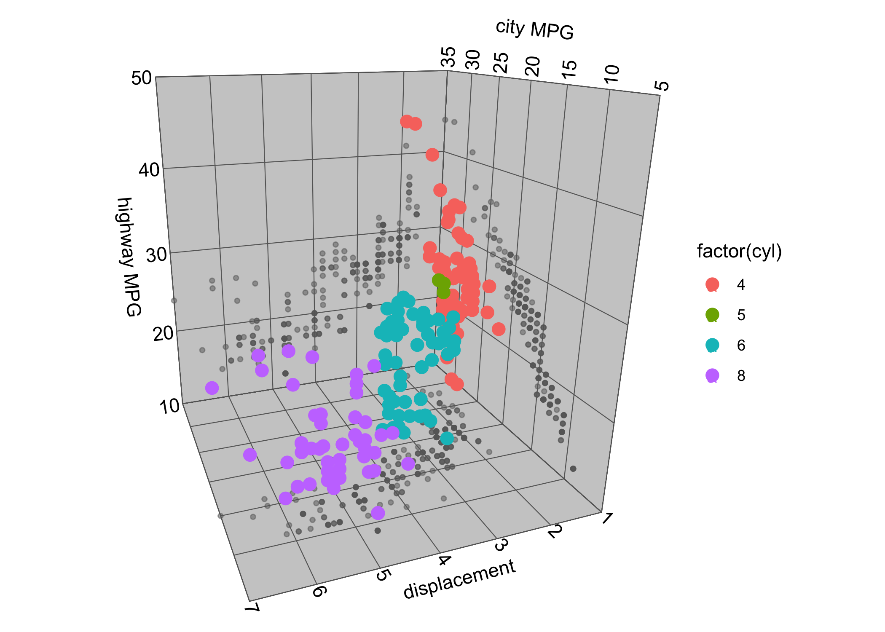
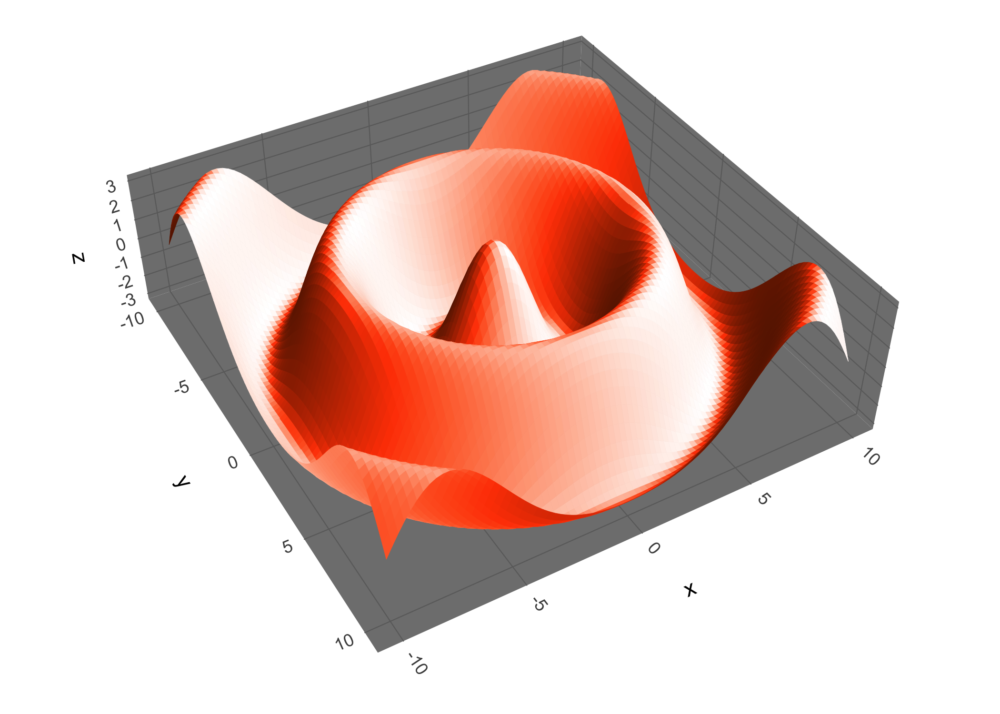
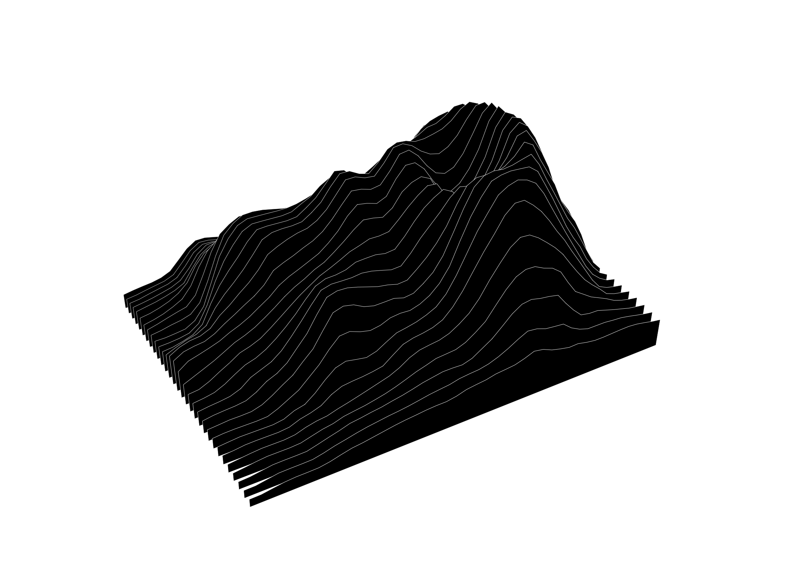

<!-- README.md is generated from README.Rmd. Please edit that file -->

# ggcube

<!-- badges: start -->
<!-- badges: end -->

The ggcube library is an extension of ggplot2 for 3D plotting.

This package is under development, and a stable version has not yet been
released.

## Example

To use ggcube, you define a `projection()` and then use standard ggplot
code along with one or more `proj_*()` layer functions.

Let’s make a 3D scatterplot of the `mpg` dataset. We’ll use
`proj_data(geom = "point")` to add our main data, and `proj_margin()` to
add some marginal scatter plots as well. In addition to adding our data,
we also have to explicitly build up the reference layers like the panel
background, gridlines, and labels.

``` r
library(ggcube)

# get data
d <- select(mpg, displ, hwy, cty, cyl)

# define projection
prj <- projection(pitch = -20, roll = 160, 
                  persp = TRUE, dist = 2, data = d)

# build plot
d %>%
      ggplot(aes(displ, hwy, z = cty, color = factor(cyl))) +
      proj_panel(prj = prj) +
      proj_gridlines(prj = prj, color = "white") +
      proj_margin(prj = prj, geom = "point", 
                  color = "gray40", size = 1, alpha = .5) +
      proj_data(prj = prj, geom = "point", size = 3) +
      proj_label(prj = prj, axis = "x", title = "displacement",
                 edge = c("ymin", "zmin")) +
      proj_label(prj = prj, axis = "y", title = "highway MPG",
                 edge = c("zmax", "xmax")) +
      proj_label(prj = prj, axis = "z", title = "city MPG",
                 edge = c("xmin", "ymax")) +
      coord_fixed() +
      theme_cube()
```



As another example, let’s use `proj_surface()` to plot a projection of a
3D function:

``` r
# create data and define projection
d <- expand_grid(x = seq(-10, 10, .5),
                 y = seq(-10, 10, .5)) %>%
      mutate(z = cos(sqrt(x^2 + y^2)))
prj <- projection(data = d, pitch = 35, yaw = 55,
                  persp = T, dist = 1, zlim = c(-3, 3))

# highlight terrain attributes using after_stat
ggplot(d, aes(x, y, z = z, fill = after_stat(dzdy))) +
      proj_surface(prj = prj) +
      scale_fill_viridis_c(option = "B") +
      theme_cube() +
      coord_fixed()
```



Finally, let’s plot the `mountain` data set that comes with the package,
using the `proj_ridgeline()` function to visualize a 3D landscape:

``` r
prj <- projection(pitch = 75, yaw = 55,
                  persp = T, dist = 1,
                  data = mountain)

mountain %>%
      ggplot(aes(x, y, z = z)) +
      proj_ridgeline(prj = prj, geom = "polygon", piece = "y",
                     fill = "black", color = "white", linewidth = .15) +
      theme_cube()
```



## Installation

You can install the development version of ggcube from
[GitHub](https://github.com/matthewkling/ggcube) with:

``` r
devtools::install_github("matthewkling/ggcube")
```
