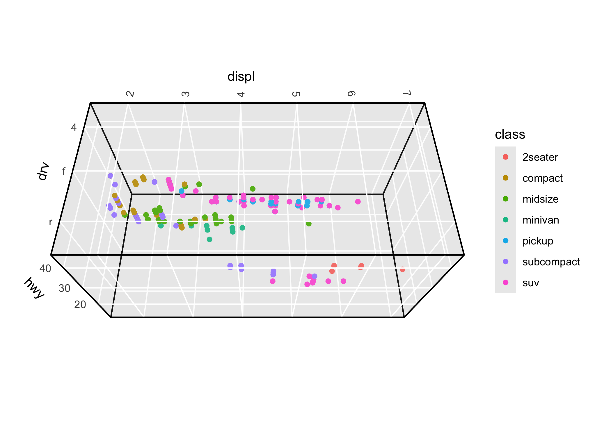

<!-- README.md is generated from README.Rmd. Please edit that file -->

# ggcube

<!-- badges: start -->
<!-- badges: end -->

**ggcube** extends ggplot2 to support 3D figures. Use it to create 3D
scatter plots, surfaces, volumes, and complex layered visualizations
using familiar ggplot2 syntax with `aes(x, y, z)` and `coord_3d()`.

The package provides a variety of 3D-specific `geom` functions to render
surfaces, prisms, points, and paths in 3D. You can control plot geometry
with 3D projection parameters, can apply a range of 3D lighting models,
and can mix 3D layers with 2D layers rendered on cube faces.

**ggcube** aims for seamless integration with ggplot2. Standard ggplot2
features work as expected, including faceting, themes, scales, legends,
and layering. In addition to the 3D-specific functions, it also works
with many existing ggplot2 stats and geoms.

WARNING: This package is in development and has not yet been officially
released. Bugs and breaking changes are not unlikely.

## Installation

You can install the development version of ggcube from
[GitHub](https://github.com/matthewkling/ggcube) with:

``` r
devtools::install_github("matthewkling/ggcube")
```

## Quick start

The essential ingredient of a ggcube plot is `coord_3d()`. Adding this
to a standard ggplot, and providing a `z` aesthetic variable, creates a
3D plot:

``` r
library(ggplot2)
library(ggcube)

# Basic 3D scatter plot
ggplot(mpg, aes(x = displ, y = hwy, z = drv, color = class)) +
      geom_point() +
      coord_3d()
```


You can control plot rotation and perspective, as well as axis label
placement and panel selection, via parameters to `coord_3d()`:

``` r
ggplot(mpg, aes(displ, hwy, drv, color = class)) +
      geom_point() +
      coord_3d(pitch = 0, roll = 60, yaw = 0, dist = 1.4, panels = "all") +
      theme(panel.border = element_rect(color = "black"),
            panel.foreground = element_rect(alpha = .1))
```



## 3D surfaces

- `geom_hull_3d()` plots triangulated volumes based on convex or alpha
  hulls of 3D points
- `geom_function()` visualizes mathematical functions
- `geom_surface_3d()` renders surfaces based on existing grid data such
  as terrain data
- `geom_smooth_3d()` fits statistical models with two predictors and
  visualizes fitted surfaces with confidence intervals
- `geom_density_3d()` creates perspective visualizations of 2D kernel
  density estimates

Example: a terrain surface using `geom_surface_3d()`:

``` r
ggplot(mountain, aes(x, y, z)) +
      geom_surface_3d(aes(fill = z, color = z),
                      light = light(direction = c(1, 0, 0))) +
      scale_fill_viridis_c() + scale_color_viridis_c() +
      coord_3d(ratio = c(1.5, 2, 1), expand = FALSE, panels = "zmin") +
      guides(fill = guide_colorbar_3d()) +
      theme_light()
```


Example: a mathematical surface using `geom_function_3d()`:

``` r
ggplot() +
      geom_function_3d(
            fun = function(x, y) cos(x) * sin(y),
            xlim = c(-pi, pi), ylim = c(-pi, pi),
            color = "black", grid = "hex"
      ) +
      coord_3d(yaw = 150) +
      theme_minimal()
```

 Example: a
fitted model surface using `geom_smooth_3d()`:

``` r
# Generate scattered 3D data
set.seed(123)
d <- data.frame(x = rnorm(50),
                y = rnorm(50))
d$z <- d$x + d$x^2 - d$y^2 + rnorm(50)

# Plot GAM fit with uncertainty layers
ggplot(d, aes(x, y, z)) + 
      geom_smooth_3d(aes(fill = after_stat(level)),
                     method = "gam", formula = z ~ te(x, y),
                     se = TRUE, level = 0.99, color = "black") +
      scale_fill_manual(values = c("red", "darkorchid4", "steelblue")) +
      coord_3d()
```


## 3D prisms

- `geom_pillar_3d()` produces 3D column charts
- `geom_voxel_3d()` renders sparse 3D pixel data as arrays of cubes
- `geom_histogram_3d()` (coming soon)
- `geom_prism_3d()` (coming soon)

Example: a 3D bar chart using `geom_pillar_3d()`:

``` r
# 3D pillar visualization
ggplot(mountain[mountain$z > 90, ], 
       aes(x, y, z, zmin = 90, fill = z)) +
    geom_pillar_3d(color = "black", linewidth = 0.1, width = .9,
                   light = light(direction = c(1, -.25, 0), color = FALSE),
                   sort_method = "pairwise") +
    coord_3d() +
    scale_fill_viridis_c(option = "B") + 
    guides(fill = guide_colorbar_3d()) +
    theme(panel.border = element_rect(color = "black", linewidth = .25))
```


## 3D paths

`geom_path_3d()` renders paths in 3D space with depth-based sorting and
scaling:

``` r
butterfly <- lorenz_attractor(n_points = 8000, dt = .01)
ggplot(butterfly, aes(x, y, z, color = time)) +
      geom_path_3d(linewidth = 0.1, color = "black",
                   position = position_on_face(c("xmax", "ymax", "zmin"))) +
      geom_path_3d(linewidth = 0.3) +
      scale_color_gradientn(colors = c("blue", "purple", "red", "orange")) +
      coord_3d() +
      theme_light()
```


## 3D points

While `ggplot2::geom_point()` works with ggcube as demonstrated above,
`geom_point_3d()` creates 3D-aware scatter plots with proper point
ordering, depth-scaled point sizes, and options to include reference
lines and reference points projecting 3D points onto 2D face panels:

``` r
ggplot(mpg, aes(x = displ, y = hwy, z = drv, fill = class)) +
      geom_point_3d(size = 3, shape = 21, color = "black", stroke = .1,
                    ref_lines = TRUE, ref_points = TRUE,
                    ref_faces = c("ymax", "xmax")) +
      coord_3d()
```


## Lighting effects

Lighting of 3D polygon layers is controlled by providing a `light()`
specification.

``` r
ggplot(sphere_points, aes(x, y, z)) +
      coord_3d(scales = "fixed") +
      scale_fill_viridis_c() +
      scale_color_viridis_c() +
      theme_dark() +
      theme(legend.position = "none") +
      
      # add shading to solid color/fill
      geom_hull_3d(fill = "#8a2900", color = "#8a2900",
                   light = light(method = "direct", mode = "hsl", 
                                 direction = c(0, 0, 1))) +
      
      # add shading to aesthetic color/fill
      geom_hull_3d(aes(x = x + 2.5, fill = x, color = x),
                   light = light(method = "diffuse", mode = "hsv", 
                                 direction = c(0, 0, 1), contrast = 2))
```


## Face projection

3D and 2D layers can be mixed by using `position_on_face()` to project
data onto cube faces. We saw this in the `geom_path_3d()` example above,
but here’s another example that mixes different geoms, including
natively-2D layers like `ggplot2::stat_density_2d()`:

``` r

ggplot(iris, aes(Sepal.Length, Sepal.Width, Petal.Length, 
                 color = Species, fill = Species)) +
      coord_3d() + xlim(4, 8) +
      
      # place 2D density plot on zmin face
      stat_density_2d(position = position_on_face(faces = "zmin", axes = c("x", "y")),
            geom = "polygon", alpha = .1, linewidth = .25) +
      
      # flatten 3D hull layer onto ymax face
      geom_hull_3d(position = position_on_face("ymax"), alpha = .5) +
      
      # flatten 3D voxels onto xmax face to create 2D bins
      geom_voxel_3d(aes(round(Sepal.Length), round(Sepal.Width), round(Petal.Length)),
            position = position_on_face("xmax"), alpha = .15, light = NULL) +
      
      # 3D scatter plot (added last so it renders in front)
      geom_point_3d( shape = 21, color = "black", stroke = .25)
```


