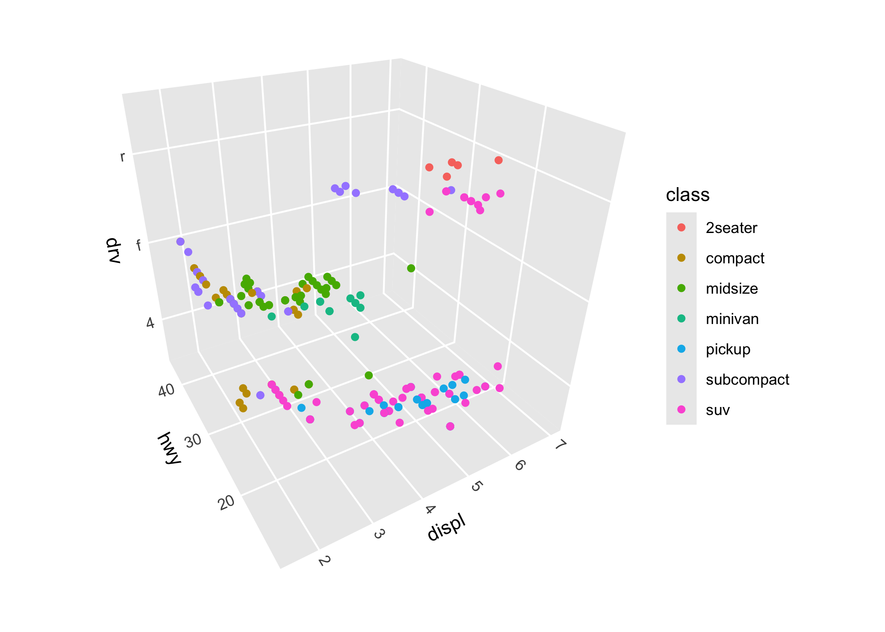

<!-- README.md is generated from README.Rmd. Please edit that file -->

# ggcube

<!-- badges: start -->
<!-- badges: end -->

**ggcube** extends ggplot2 into three dimensions, providing a grammar of
graphics for 3D data visualization. Create 3D scatter plots, surfaces,
volumes, and complex layered visualizations using familiar ggplot2
syntax with `aes(x, y, z)` and `coord_3d()`.

The package provides a variety of 3D-specific layer functions to render
surfaces, prisms, points, and paths in 3D. Users can control plot
geometry with 3D projection parameters, can apply a range of 3D lighting
models, and can mix 3D layers with 2D layers rendered on cube faces.

**ggcube** aims for seamless integration with ggplot2. Standard ggplot2
features work as expected, including faceting, themes, scales, legends,
and layering. In addition to the 3D-specific functions, it also works
with many existing ggplot2 stats and geoms.

## Installation

You can install the development version of ggcube from
[GitHub](https://github.com/matthewkling/ggcube) with:

``` r
devtools::install_github("matthewkling/ggcube")
```

## Quick start

The essential ingredient of a ggcube plot is `coord_3d()`. Adding this
to a standard ggplot, and providing a third (`z`) aesthetic variable
creates a 3D plot:

``` r
library(ggplot2)
library(ggcube)

# Basic 3D scatter plot
ggplot(mtcars, aes(mpg, wt, qsec, color = factor(cyl))) +
      geom_point() +
      coord_3d()
```



### Surface functions

- `stat_surface_3d()` renders surfaces based on existing grids data such
  as terrain data
- `stat_smooth_3d()` fits statistical models to input data and
  visualizes fitted predictions and confidence intervals
- `stat_function()` visualizes mathematical functions
- `stat_density_3d()` creates perspective visualizations of 2D kernel
  density estimates
- `stat_hull_3d()` plots volumetric surfaces based on convex or alpha
  hulls of 3D point clouds

Example: a fitted model surface using `stat_smooth_3d()`:

``` r
# Generate scattered 3D data
set.seed(123)
d <- data.frame(x = runif(100, -2, 2),
                y = runif(100, -2, 2))
d$z <- abs(1 + d$x^2 - d$y^2 + rnorm(100, 0, 1))

# GAM fit with uncertainty layers
ggplot(d, aes(x, y, z)) + 
      stat_smooth_3d(aes(fill = after_stat(level)),
                   method = "gam", fomula = z ~ te(x, y),
                   se = TRUE, level = 0.99, color = "black") +
      scale_fill_manual(values = c("red", "darkorchid4", "steelblue")) +
      coord_3d()
```


Example: a terrain surface using `stat_function_3d()`:

``` r
ggplot(mountain, aes(x, y, z)) +
      stat_surface_3d(aes(fill = z, color = z),
                   light = lighting(direction = c(1, 0, 1), blend = "both")) +
      scale_fill_viridis_c() + scale_color_viridis_c() +
      coord_3d(yaw = 130, ratio = c(2, 2, 1))
```


Example: a mathematical surface using `stat_function_3d()`:

``` r
ggplot() +
      stat_function_3d(
            fun = function(x, y) cos(x) * sin(y),
            xlim = c(-pi, pi), ylim = c(-pi, pi),
            color = "black"
      ) +
      coord_3d() +
      theme_minimal()
```


### Prism-type layers

- `stat_voxel_3d()` renders sparse 3D pixel data as rectangular prisms
- `stat_pillar_3d()`
- `stat_histogram_3d()` (forthcoming)
- `stat_prism_3d()` (forthcoming)

Example: a 3D bar chart using `stat_pillar_3d()`:

``` r
# 3D pillar visualization
set.seed(123)
data <- data.frame(x = sample(1:10, 20, replace = TRUE),
                   y = sample(1:10, 20, replace = TRUE),
                   z1 = runif(20),
                   z2 = runif(20))
ggplot(data, aes(x, y, z1, zmin = z2, fill = z2 - z1)) +
      stat_pillar_3d(color = "black", linewidth = 0.1, width = 1) +
      scale_fill_gradient2()+
      coord_3d()
```


### Points and paths

- `geom_point_3d()` creates 3D scatter plots with depth-scaled point
  sizes and options to include reference lines and reference points
  projecting 3D points onto 2D panel faces
- `geom_path_3d()` (forthcoming)

Example: A scatter plot with reference elements, using
`geom_points_3d()`:

``` r
ggplot(mtcars, aes(mpg, wt, qsec, fill = factor(cyl))) +
      geom_point_3d(size = 5, shape = 21, color = "black", stroke = .1,
                    ref_lines = TRUE, ref_points = TRUE,
                    ref_faces = c("zmin", "xmax")) +
      coord_3d()
```


### Lighting effects

Realistic 3D shading with `lighting()`

### Face projection

`position_on_face()` for projecting layers onto cube faces

### Seamless ggplot2 integration

ggcube works with the complete ggplot2 ecosystem:

``` r
ggplot(iris, aes(Sepal.Length, Sepal.Width, Petal.Length,
                 fill = Species, color = Species)) +
      geom_point_3d() +
      stat_hull_3d(alpha = 0.5, color = "black") +
      labs(title = "3D Species Comparison") +
      coord_3d(scales = "fixed") +
      theme_light() +
      facet_wrap(~Species)
```


## Learn more

- **Function reference**: Complete documentation of all functions
- **Getting started**: Introduction to 3D plotting concepts  
- **Gallery**: Examples showcasing different visualization types
- **Advanced topics**: Lighting, projections, and complex layering
