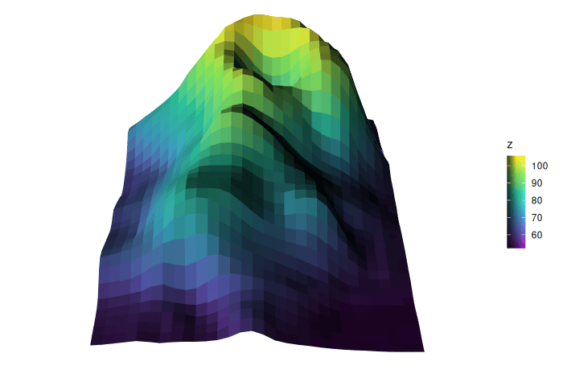
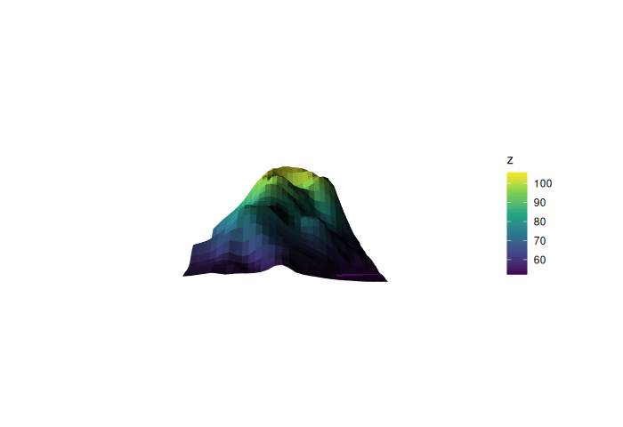

# Animated and interactive rotation

``` r

library(ggcube)
```

Because ggcube renders a 3D scene from a fixed camera angle, a single
plot only ever shows one viewpoint. Two functions let you show more than
one:
[`animate_3d()`](https://matthewkling.github.io/ggcube/reference/animate_3d.md)
moves the camera through a sequence of angles and plays them back as a
GIF or movie, while
[`flipbook_3d()`](https://matthewkling.github.io/ggcube/reference/flipbook_3d.md)
renders the same kind of sequence (or a 2D grid of rotation angles) into
a self-contained HTML widget you can drag to rotate. Animations and
flipbooks can be displayed in RStudio’s viewer, viewed in a web browser,
or knit into RMarkdown documents like Reveal.js presentations or pkgdown
articles.

Both functions simply render the plot many times at different rotations,
so they preserve ggcube’s exact look — every frame is a real ggcube
render, with the same lighting, depth sorting, and color scales.

The two functions share a rotation vocabulary. They operate on a
pre-existing ggcube plot object, and take `pitch`, `roll`, and `yaw`
arguments that define rotation ranges to move through.

We’ll use a common base plot throughout this article:

``` r

p <- ggplot(mountain, aes(x, y, z, fill = z, color = z)) +
  geom_surface_3d(linewidth = .25) +
  coord_3d(light = light(anchor = "camera", direction = c(1, 1, 0)),
           ratio = c(1.5, 2, 1)) +
  scale_fill_viridis_c() +
  scale_color_viridis_c() +
  theme_void()
```

## Animation

[`animate_3d()`](https://matthewkling.github.io/ggcube/reference/animate_3d.md)
takes a plot and a set of keyframe angles, interpolates between them,
and renders the frames into an animation. Each of `pitch`, `roll`, and
`yaw` is either held at a single value or given as a vector of keyframes
to move through; the camera is linearly interpolated between successive
keyframes.

The most common case is a turntable spin — a full `yaw` rotation,
holding the other angles fixed. `nframes` sets the number of rendered
frames and `fps` the playback speed:

``` r

animate_3d(p, yaw = c(0, 360), nframes = 60, fps = 10, width = 700)
```



Keyframes can also trace a more complex path. Here the view moves
through several angles on two axes at once, tilting on the `roll` axis
while it spins in `yaw`:

``` r

animate_3d(p,
           yaw = c(0, 720),
           roll = c(-90, 0, -90),
           nframes = 120, fps = 10, width = 700)
```



By default the animation is written to a temporary file and displayed,
but you can use `file =` to save it.

See
[`?animate_3d`](https://matthewkling.github.io/ggcube/reference/animate_3d.md)
for the full set of playback options, including frame timing, pauses,
rewind, alternative renderers, and parallel rendering.

## Interaction

[`flipbook_3d()`](https://matthewkling.github.io/ggcube/reference/flipbook_3d.md)
renders the same kind of rotation sequence, but it packages the frames
into an interactive HTML widget you can drag to rotate. Clicking and
dragging with your cursor, or using your keyboard arrow keys (after
clicking or tab-selecting the plot), changes the viewing angle.
Smoothness is governed by the frame count `n`.

Rotation is specified the same way as in animation, except that here
each angle is given as a range rather than a keyframe path. A single
range gives a 1D flipbook — drag left and right to turn it:

``` r

flipbook_3d(p, yaw = c(360, 0), n = 36, width = 700)
```

Give two ranges for a 2D flipbook: horizontal drag turns one axis and
vertical drag the other, letting you spin the surface horizontally while
tilting it up and down. The two numbers in `n` set the resolution of
each axis, so keep them modest — the number of rendered frames is their
product:

``` r

flipbook_3d(p, yaw = c(360, 0), roll = c(-90, 0), n = c(24, 12), width = 700)
```

A full-turn axis (like `yaw = c(360, 0)`) wraps around seamlessly, so
you can keep dragging in one direction forever; a partial range (like
the `roll` above) stops at its end. Note that for `yaw` specifically,
specifying the larger angle first (e.g. `c(360, 0)`) is generally
preferred so that rotation direction matches drag direction. Use
`start =` to choose the opening angle.

See
[`?flipbook_3d`](https://matthewkling.github.io/ggcube/reference/flipbook_3d.md)
for additional details.

## Computational considerations

Pre-rendering dozens or hundreds of frames can take some time, and can
generate large files. If needed, you can speed up rendering using
parallelization, via the `cores` parameter. You can also reduce the
number of frames with the `n` parameter, and change the size of the
resulting images with `width`/`height`.
