# Introduction to ggcube

ggcube is a ggplot2 extension for 3D plotting. It provides 3D geoms,
stats, and a 3D coordinate system that let you build 3D visualizations
using the familiar ggplot2 grammar: map your data to aesthetics, add
layers, and customize the result with scales, guides, and themes.

``` r

library(ggcube)
```

## The basics

The essential ingredient of a ggcube plot is
[`coord_3d()`](https://matthewkling.github.io/ggcube/reference/coord_3d.md).
Adding it to a standard ggplot that includes a `z` aesthetic creates a
3D plot:

``` r

ggplot(mpg, aes(x = displ, y = hwy, z = drv, color = class)) +
      geom_point() +
      coord_3d()
```

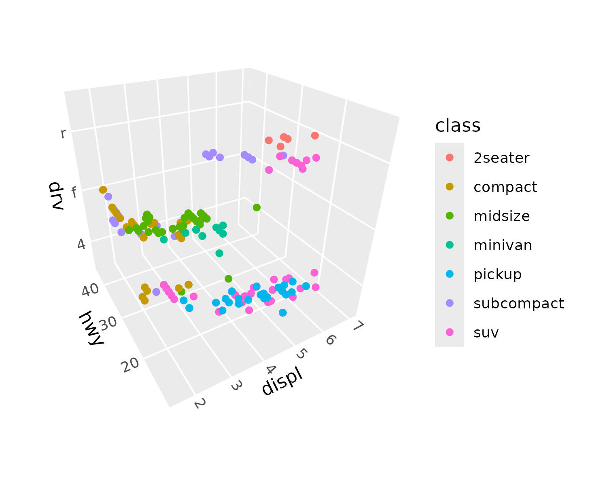

Some standard ggplot2 layers like
[`geom_point()`](https://ggplot2.tidyverse.org/reference/geom_point.html)
work in 3D automatically. ggcube also provides 3D-specific layer
functions for surfaces, paths, volumes, and text, described below.

Because ggcube works within ggplot2’s 2D graphics engine, there are some
important things to understand about how rendering works. Each 3D layer
projects its geometry onto a 2D plane, with depth sorting to determine
which elements appear in front of others. This sorting happens *within*
each layer, but not *across* layers — just as in standard ggplot2, later
layers are drawn on top of earlier ones regardless of their 3D depth.
This means that layer order in your code matters, and complex
multi-layer scenes may require some thought about stacking.

## Controlling the view

[`coord_3d()`](https://matthewkling.github.io/ggcube/reference/coord_3d.md)
controls how the 3D scene is projected onto 2D. Rotation is specified
via three angles — `pitch` (tilt around the x-axis), `roll` (tilt around
the y-axis), and `yaw` (spin around the z-axis):

``` r

ggplot(mpg, aes(displ, hwy, drv, color = class)) +
      geom_point() +
      coord_3d(pitch = 0, roll = 60, yaw = 0, dist = 1.4,
               ratio = c(2, 1, 1), panels = "all") +
      theme(panel.border = element_rect(color = "black"),
            panel.foreground = element_rect(alpha = .1))
```

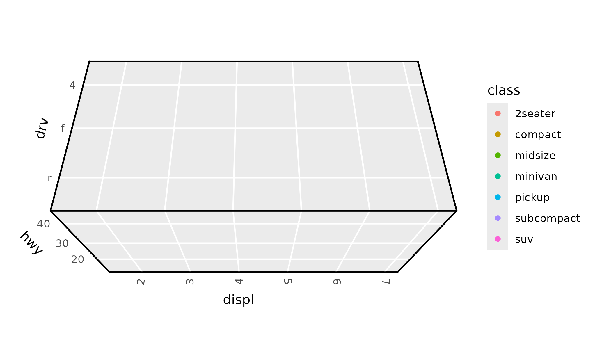

Perspective projection is on by default, making distant objects appear
smaller. The `dist` parameter controls the strength of this effect
(larger values = less distortion), and `persp = FALSE` switches to
orthographic projection where parallel lines stay parallel.

The `scales` parameter controls how axis ranges map to visual size.
`"free"` (the default) stretches each axis independently to fill the
cube, while `"fixed"` preserves the relative scale of the data (like
[`coord_fixed()`](https://ggplot2.tidyverse.org/reference/coord_fixed.html)
in 2D). The `ratio` parameter lets you set custom proportions for the
three axes. And `zoom` adjusts overall framing without changing the
rotation or projection.

See the [3D
view](https://matthewkling.github.io/ggcube/articles/coord_3d.html)
article for a comprehensive guide to all view parameters.

## 3D layers

Most standard ggplot2 geoms are designed around 2D coordinate
assumptions, and won’t render correctly with
[`coord_3d()`](https://matthewkling.github.io/ggcube/reference/coord_3d.md).
(An exception is
[`geom_point()`](https://ggplot2.tidyverse.org/reference/geom_point.html),
which works out of the box as shown above, albeit with ordering and
sizing limitations.) ggcube provides a range of 3D-native layer
functions that cover common 3D plot types, including points, surfaces,
bars, paths, and text.

Here’s a quick tour of the main categories.

### Surfaces

Several geoms and stats work together to render surfaces.
[`geom_surface_3d()`](https://matthewkling.github.io/ggcube/reference/stat_surface_3d.md)
renders data as a tessellated surface,
[`geom_contour_3d()`](https://matthewkling.github.io/ggcube/reference/geom_contour_3d.md)
creates layer-cake contour stacks, and
[`geom_ridgeline_3d()`](https://matthewkling.github.io/ggcube/reference/geom_ridgeline_3d.md)
shows cross-sectional slices:

``` r

ggplot(mountain, aes(x, y, z)) +
      geom_surface_3d(aes(fill = z, color = z)) +
      scale_fill_viridis_c() + scale_color_viridis_c() +
      coord_3d(ratio = c(1.5, 2, 1), expand = FALSE, panels = "zmin",
               light = light(direction = c(1, 0, 0))) +
      guides(fill = guide_colorbar_3d()) +
      theme_light()
```

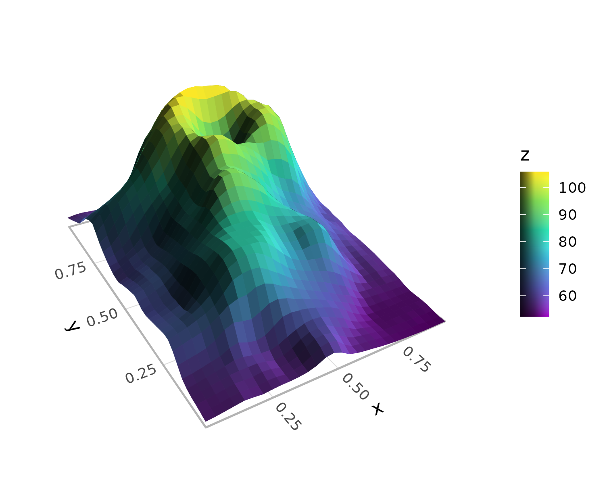

Stats like
[`stat_function_3d()`](https://matthewkling.github.io/ggcube/reference/stat_function_3d.md),
[`stat_smooth_3d()`](https://matthewkling.github.io/ggcube/reference/geom_smooth_3d.md),
and
[`stat_density_3d()`](https://matthewkling.github.io/ggcube/reference/stat_density_3d.md)
generate surface data from functions, model fits, or kernel density
estimates. These stats can be paired with any of the surface geoms. See
the [3D
surfaces](https://matthewkling.github.io/ggcube/articles/surfaces.html)
article for more detail on surface plotting options.

### Points

[`geom_point_3d()`](https://matthewkling.github.io/ggcube/reference/geom_point_3d.md)
extends scatter plots with depth-scaled point sizes (closer points shown
larger), proper depth sorting (closer points plotted on top), and
optional reference lines and points that project onto cube faces:

``` r

ggplot(mpg, aes(x = displ, y = hwy, z = drv, fill = class)) +
      geom_point_3d(size = 3, shape = 21, color = "black", stroke = .1,
                    ref_lines = TRUE, ref_faces = c("ymax", "xmax")) +
      coord_3d()
```

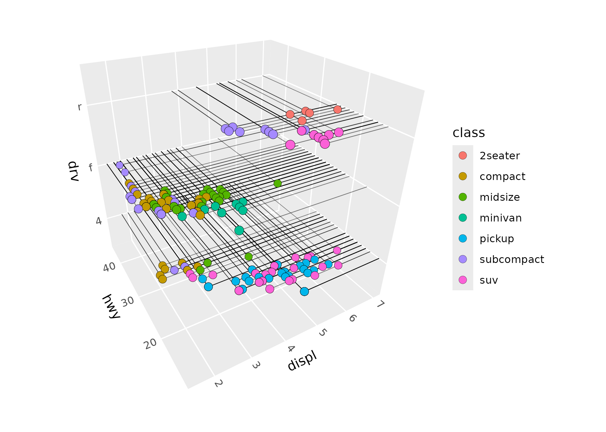

### Paths

[`geom_path_3d()`](https://matthewkling.github.io/ggcube/reference/geom_path_3d.md)
connects observations with depth-sorted, depth-scaled line segments:

``` r

x <- seq(0, 20*pi, pi/16)
spiral <- data.frame(x = x, y = sin(x), z = cos(x), time = 1:length(x))
ggplot(spiral, aes(x, y, z, color = time)) +
      geom_path_3d() +
      scale_color_gradientn(colors = c("blue", "purple", "red", "orange")) +
      coord_3d() +
      theme_light()
```

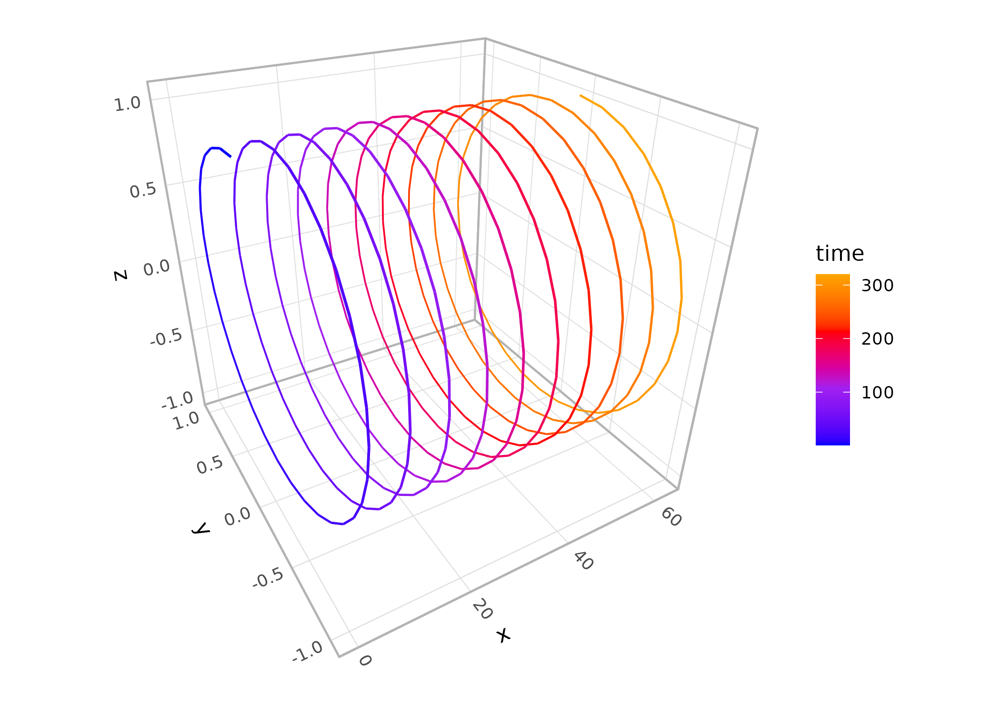

[`geom_segment_3d()`](https://matthewkling.github.io/ggcube/reference/geom_segment_3d.md)
is also available for drawing individual segments defined by start and
end coordinates.

### Prisms

[`geom_col_3d()`](https://matthewkling.github.io/ggcube/reference/geom_col_3d.md)
produces 3D column charts,
[`geom_bar_3d()`](https://matthewkling.github.io/ggcube/reference/geom_bar_3d.md)
creates 3D histograms with automatic binning, and
[`geom_voxel_3d()`](https://matthewkling.github.io/ggcube/reference/geom_voxel_3d.md)
renders arrays of cubes:

``` r

ggplot(iris, aes(Species, Sepal.Length, fill = Species)) +
      geom_bar_3d(bins = 20, width = c(.5, 1)) +
      coord_3d(scales = "fixed", ratio = c(1, 3, .25), yaw = 60) +
      scale_z_continuous(expand = c(0, 0)) +
      theme(legend.position = "none")
```

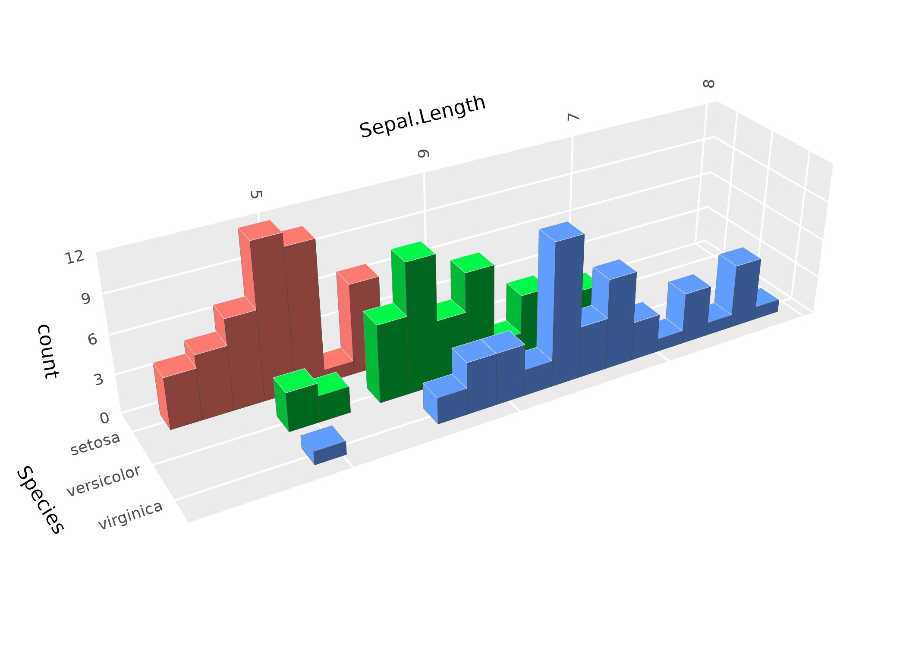

### Hulls

[`geom_hull_3d()`](https://matthewkling.github.io/ggcube/reference/geom_hull_3d.md)
computes and renders triangulated hulls from 3D point clouds, including
convex and alpha hulls:

``` r

ggplot(sphere_points, aes(x, y, z)) +
      geom_hull_3d(method = "convex", fill = "#9e2602", color = "#5e1600") +
      coord_3d()
```

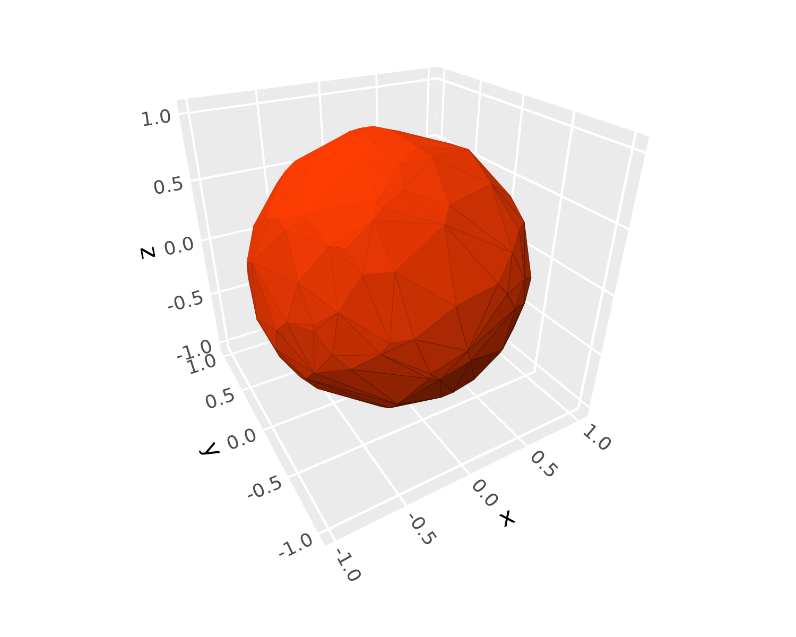

### Distributions

[`stat_distributions_3d()`](https://matthewkling.github.io/ggcube/reference/stat_distributions_3d.md)
computes 1D kernel density estimates per group and arranges them as
ridgeline surfaces, the 3D analog of `ggridges::geom_density_ridges()`:

``` r

ggplot(iris, aes(y = Sepal.Length, x = Species, fill = Species)) +
      stat_distributions_3d() +
      scale_z_continuous(expand = expansion(mult = c(0, NA))) +
      coord_3d() +
      theme(legend.position = "none")
```

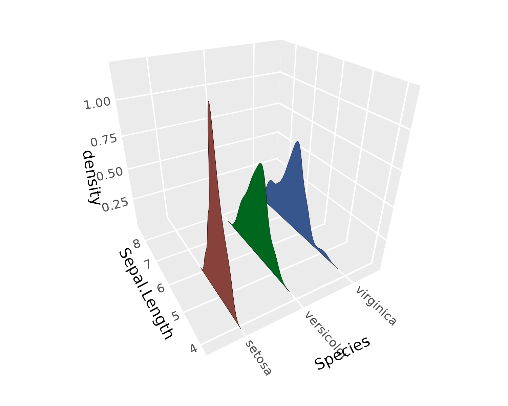

### Text

[`geom_text_3d()`](https://matthewkling.github.io/ggcube/reference/geom_text_3d.md)
renders text in 3D, either as “billboard” labels that always face the
camera, or as polygon outlines that can be oriented in any direction:

``` r

df <- expand.grid(x = c("H", "B"), y = c("a", "o", "u"), z = c("g", "t"))
df$label <- paste0(df$x, df$y, df$z)
ggplot(df, aes(x, y, z, label = label, fill = x)) +
      geom_text_3d(method = "polygon", facing = "zmax",
                   size = 5, weight = "bold") +
      coord_3d(scales = "fixed", light = NULL)
```

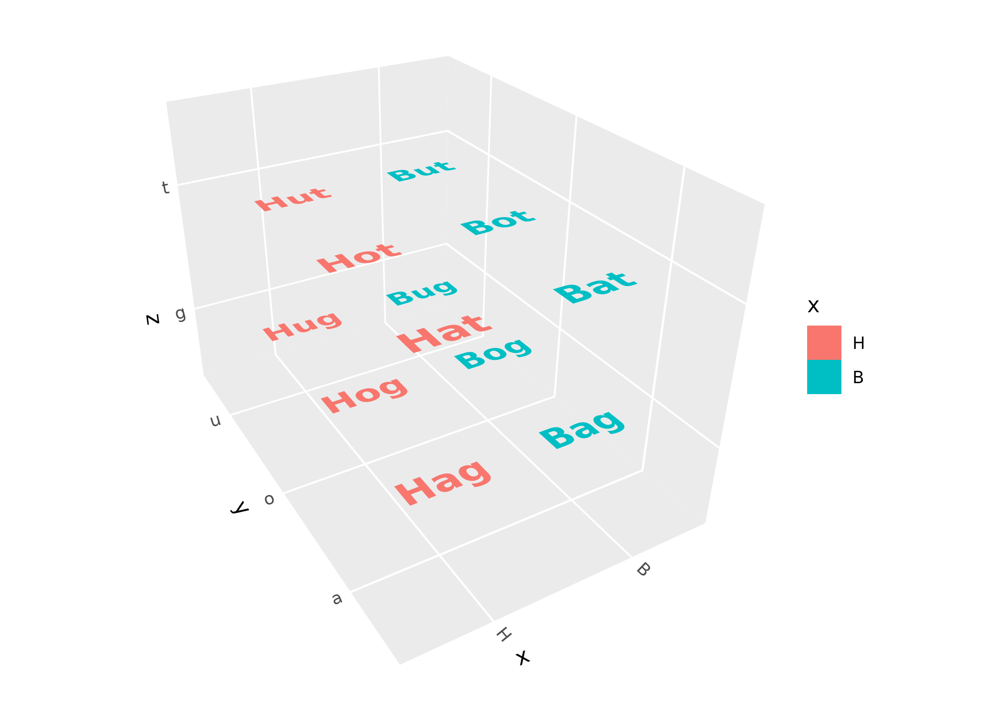

## Lighting

Lighting modifies the fill and/or color of polygon faces based on their
orientation relative to a light source, giving surfaces a sense of depth
and shape. It’s controlled via the
[`light()`](https://matthewkling.github.io/ggcube/reference/light.md)
function, which can be passed to
[`coord_3d()`](https://matthewkling.github.io/ggcube/reference/coord_3d.md)
(applying to all layers) or to individual layer functions (overriding
the coord-level setting):

``` r

p <- ggplot(sphere_points, aes(x, y, z)) +
      geom_hull_3d(fill = "#9e2602", color = "#5e1600")

p + coord_3d(light = light(method = "direct", mode = "hsl",
                           direction = c(0, 0, 1)))
```

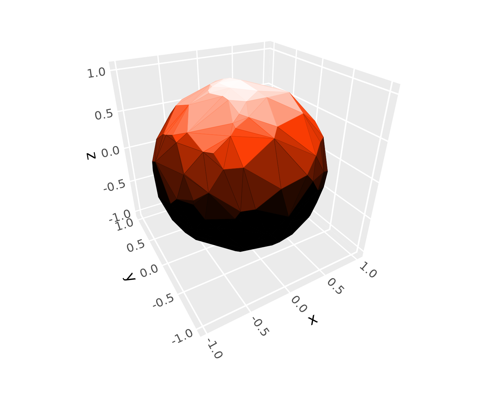

Use `light = "none"` to disable lighting entirely, or `light = NULL` in
a layer to inherit the coord-level setting. For a comprehensive guide to
lighting methods, color modes, light direction, and backface handling,
see the
[lighting](https://matthewkling.github.io/ggcube/articles/lighting.html)
article.

## Scales, guides, and themes

### Z-axis scales

ggcube provides
[`scale_z_continuous()`](https://matthewkling.github.io/ggcube/reference/scale_z_continuous.md)
and
[`scale_z_discrete()`](https://matthewkling.github.io/ggcube/reference/scale_z_discrete.md)
for controlling the z-axis, with the same interface as their x/y
counterparts.
[`zlim()`](https://matthewkling.github.io/ggcube/reference/zlim.md) is a
shorthand for setting z-axis limits:

``` r

ggplot(mtcars, aes(mpg, wt, z = qsec)) +
      geom_point() +
      zlim(15, 20) +
      coord_3d()
```

### Shaded guides

When lighting is active, standard color guides don’t reflect the shading
visible in the plot.
[`guide_colorbar_3d()`](https://matthewkling.github.io/ggcube/reference/guide_3d.md)
and
[`guide_legend_3d()`](https://matthewkling.github.io/ggcube/reference/guide_3d.md)
create guides that show the range of shaded colors:

``` r

ggplot(mountain, aes(x, y, z, fill = z)) +
      stat_surface_3d(light = light(mode = "hsl", direction = c(1, 0, 0))) +
      guides(fill = guide_colorbar_3d()) +
      scale_fill_gradientn(colors = c("tomato", "dodgerblue")) +
      coord_3d()
```

### Panels and themes

The `panels` argument to
[`coord_3d()`](https://matthewkling.github.io/ggcube/reference/coord_3d.md)
controls which cube faces are drawn. Faces behind the data are
“background” panels; faces in front are “foreground” panels (which
default to semi-transparent so they don’t obscure the data):

``` r

ggplot(sphere_points, aes(x, y, z)) +
      geom_hull_3d() +
      coord_3d(panels = "all") +
      theme(panel.background = element_rect(color = "black"),
            panel.border = element_rect(color = "black"),
            panel.foreground = element_rect(alpha = .3),
            panel.grid.foreground = element_line(color = "gray", linewidth = .25),
            axis.text = element_text(color = "darkblue"),
            axis.text.z = element_text(color = "darkred"),
            axis.title = element_text(margin = margin(t = 30)),
            axis.title.x = element_text(color = "magenta"))
```

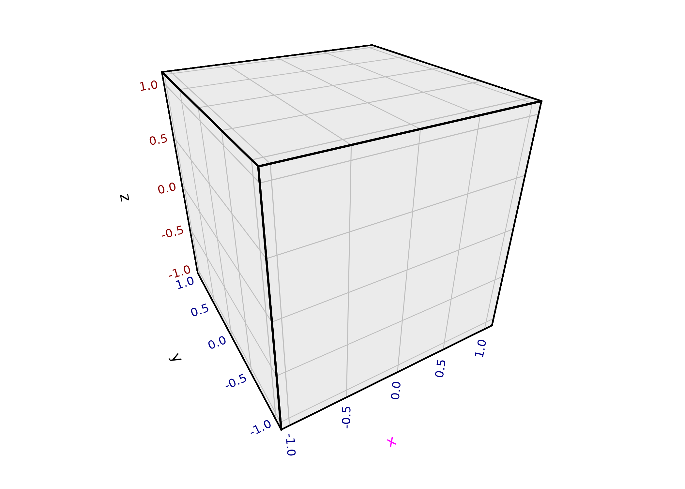 Standard ggplot2 themes and
[`theme()`](https://ggplot2.tidyverse.org/reference/theme.html)
customization work as expected. ggcube adds foreground-specific elements
(`panel.foreground`, `panel.grid.foreground`, `panel.border.foreground`)
and z-axis text elements (`axis.text.z`, `axis.title.z`). ggcube’s
[`element_rect()`](https://matthewkling.github.io/ggcube/reference/element_rect.md)
extends ggplot2’s version with an `alpha` parameter for transparency.
For details, see the theming section of the [3D
coordinates](https://matthewkling.github.io/ggcube/articles/coord_3d.html)
article.

## Annotations

[`annotate_3d()`](https://matthewkling.github.io/ggcube/reference/annotate_3d.md)
adds reference geometry — points, text labels, or segments — to any 3D
layer. Unlike adding a separate layer, annotations are embedded within
the host layer so they participate in the same depth sorting:

``` r

summit <- filter(mountain, z == max(z))
ggplot(mountain, aes(x, y, z)) +
      geom_contour_3d(
            annotate = list(
                  annotate_3d("point", x = summit$x, y = summit$y, z = summit$z, color = "red"),
                  annotate_3d("text", x = summit$x, y = summit$y, z = summit$z, color = "red",
                              label = "Summit", fontface = "bold", vjust = -1)
            ), fill = "black"
      ) +
      coord_3d(ratio = c(2, 3, 1.5), light = "none")
```

## Mixing 2D and 3D

[`position_on_face()`](https://matthewkling.github.io/ggcube/reference/position_on_face.md)
lets you project layers onto cube faces, enabling a mix of 3D and 2D
content. You can flatten a 3D layer onto a face, or place a natively 2D
layer (like
[`stat_density_2d()`](https://ggplot2.tidyverse.org/reference/geom_density_2d.html))
onto a specific face using the `axes` parameter:

``` r

ggplot(iris, aes(Sepal.Length, Sepal.Width, Petal.Length,
                 color = Species, fill = Species)) +
      coord_3d() + xlim(4, 8) +
      stat_density_2d(position = position_on_face(faces = "zmin", axes = c("x", "y")),
                      geom = "polygon", alpha = .1, linewidth = .25) +
      geom_hull_3d(position = position_on_face("ymax"), alpha = .5) +
      geom_point_3d(shape = 21, color = "black", stroke = .25)
```

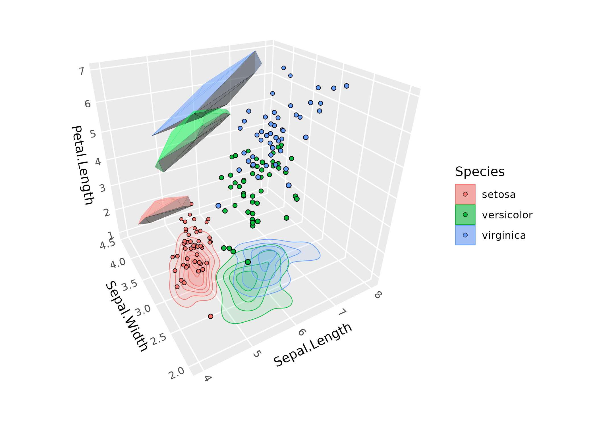

## Interactivity & animation

A major limitation of 3D figures is that you can’t get a full view of
the data from any single angle. One way to mitigate this is by rotating
the figure to view the data from different directions. ggcube offers
interactive drag-to-rotate plots via
[`flipbook_3d()`](https://matthewkling.github.io/ggcube/reference/flipbook_3d.md)
and animated rotations via
[`animate_3d()`](https://matthewkling.github.io/ggcube/reference/animate_3d.md).

For animation, rotation angles are specified as keyframe vectors that
get interpolated across frames:

``` r

p <- ggplot(mountain, aes(x, y, z)) +
      geom_contour_3d(fill = "black", color = "white", linewidth = .5) +
      coord_3d(ratio = c(1.5, 2, 1), light = "none", zoom = 1.5) +
      theme_void()

animate_3d(p, yaw = c(0, 360))
```

Output format is controlled via renderers:
[`gifski_renderer_3d()`](https://matthewkling.github.io/ggcube/reference/renderers_3d.md)
(GIF, the default),
[`av_renderer_3d()`](https://matthewkling.github.io/ggcube/reference/renderers_3d.md)
(MP4), or
[`file_renderer_3d()`](https://matthewkling.github.io/ggcube/reference/renderers_3d.md)
(individual frames). Use
[`anim_save_3d()`](https://matthewkling.github.io/ggcube/reference/anim_save_3d.md)
to save the result to a file.
