# Lighting and shading

``` r

library(ggcube)
library(patchwork)
theme_set(theme_gray())
theme_update(axis.text = element_blank(),
             axis.title = element_blank())
```

Lighting modifies the fill and/or color of polygon faces based on their
orientation relative to a light source, giving surfaces and volumes a
sense of depth and shape. It applies to any polygon-based 3D layer —
surfaces, hulls, bars, voxels, and polygon text — but is useful mainly
for layers where polygon orientation varies.

This vignette covers how to control [what parts](#lighting-targets) of
your plot lighting is applied to, how lighting model parameters change
the [visual qualities](#light-qualities) of the lighting, how to change
the direction of the [light source](#light-sources), how to control how
the [underside](#backface-lighting) of a polygon is lit, and how to add
[lighting-aware guides](#id_3d-guides) to your plot.

We’ll use a common base plot throughout. Here it is with default
lighting:

``` r

p <- ggplot(sphere_points, aes(x, y, z)) +
  geom_hull_3d(fill = "#9e2602", color = "#5e1600") +
  coord_3d(scales = "fixed")
p
```

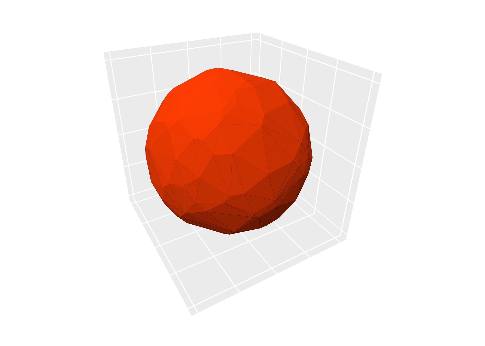

## Lighting targets

Lighting can be set at two levels:

- **Coord-level**: `coord_3d(light = light(...))` applies to all layers
  in the plot.
- **Layer-level**: `geom_*_3d(light = light(...))` overrides the
  coord-level setting for that layer.

Use `light = "none"` to disable lighting entirely, or `light = NULL` in
a layer to inherit the coord-level setting (the default layer behavior).
Here we add a second layer to our plot, and override the inherited light
settings to disable lighting for this layer:

``` r

p + geom_hull_3d(aes(x = x + 2.5), fill = "#9e2602", color = "#5e1600",
                 light = "none")
```

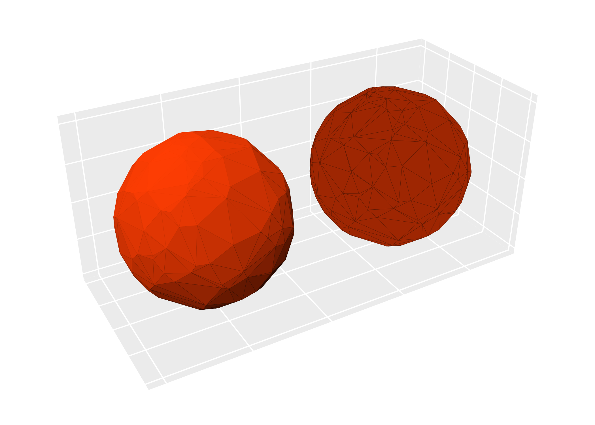

The `fill` and `color` parameters control which aesthetics get modified
by lighting. By default both are `TRUE`:

``` r

(p + ggtitle("fill + color (default)")) +
  (p + coord_3d(light = light(fill = TRUE, color = FALSE)) +
      ggtitle("fill only"))
```

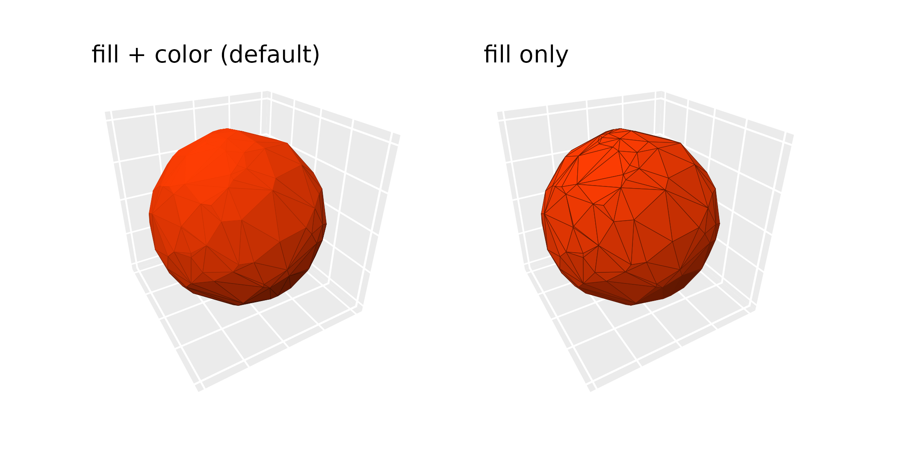

Lighting works with both solid and aesthetically-mapped colors:

``` r

ggplot(sphere_points, aes(x, y, z)) +
  geom_hull_3d(aes(fill = x, color = x)) +
  scale_fill_viridis_c() +
  scale_color_viridis_c() +
  guides(fill = guide_colorbar_3d()) +
  coord_3d(light = light("direct"))
```

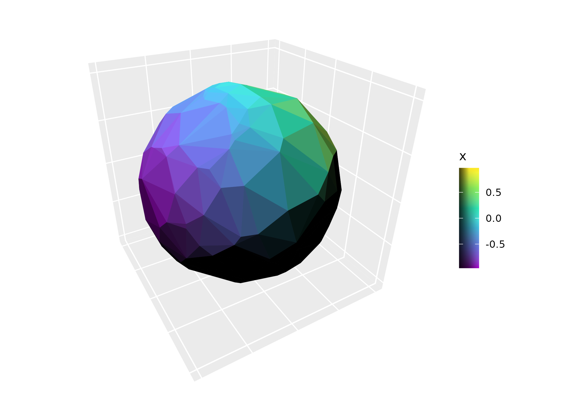

## Light qualities

### Lighting methods

The `method` parameter controls the lighting model:

- **`"diffuse"`** (default): Soft, atmospheric lighting. Only surfaces
  pointing directly away from the light source are fully dark.
- **`"direct"`**: Hard lighting. All surfaces angled beyond 90 degrees
  from the light are fully dark.
- **`"rgb"`**: Maps surface orientation to RGB color space, replacing
  the base colors entirely.

``` r

(p + coord_3d(light = light(method = "diffuse")) + ggtitle('"diffuse" (default)')) +
  (p + coord_3d(light = light(method = "direct")) + ggtitle('"direct"')) +
  (p + coord_3d(light = light(method = "rgb")) + ggtitle('"rgb"')) +
  plot_layout(ncol = 3)
```

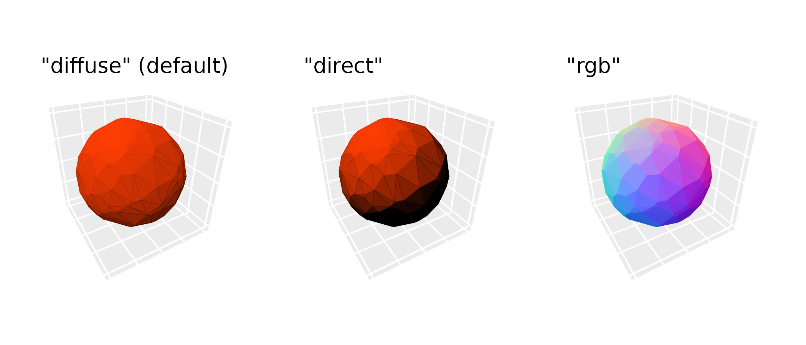

### Color modes

The `mode` parameter controls how lighting modifies colors. This applies
to the `"diffuse"` and `"direct"` methods (not `"rgb"`). There are two
color modes:

- **`"hsv"`** (default): Modifies the value component of HSV color.
  Highlights preserve hue; shadows fade to black.
- **`"hsl"`**: Modifies the lightness component of HSL color. Highlights
  fade to white; shadows fade to black.

The two modes give identical results for grayscale base colors.

``` r

(p + coord_3d(light = light(mode = "hsv")) +
    ggtitle('"hsv" (default)')) +
  (p + coord_3d(light = light(mode = "hsl")) +
      ggtitle('"hsl"'))
```

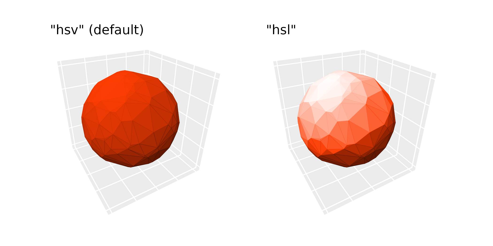

### Contrast strength

The `contrast` parameter scales the intensity of lighting effects.
Values less than 1 give subtler effects; values greater than 1 give more
dramatic ones:

``` r

(p + coord_3d(light = light(mode = "hsl", contrast = 0.5)) +
    ggtitle("contrast = 0.5")) +
  (p + coord_3d(light = light(mode = "hsl", contrast = 1)) +
      ggtitle("contrast = 1 (default)")) +
  (p + coord_3d(light = light(mode = "hsl", contrast = 1.5)) +
      ggtitle("contrast = 1.5")) +
  plot_layout(ncol = 3)
```

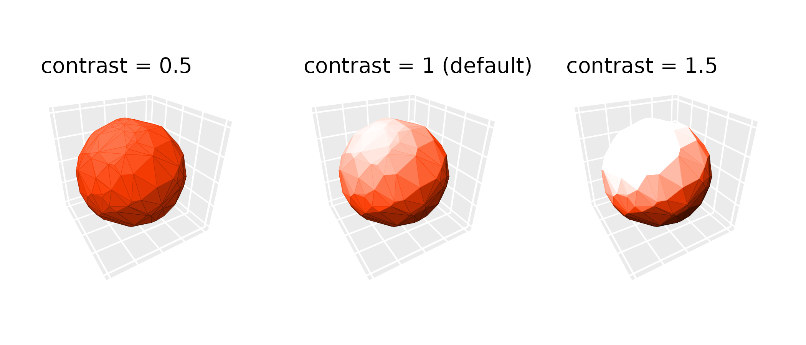

## Light sources

### Direction and anchoring

The `direction` parameter is a length-3 vector specifying where light
comes from; for example, `direction = c(0, -1, 0)` lights the plot from
the negative y direction. The `anchor` parameter controls whether this
direction is relative to the data axes or the camera:

- **`anchor = "scene"`** (default): Direction is relative to the data
  axes and rotates with the plot. `direction = c(1, 0, 0)` always lights
  surfaces facing the “xmax” face.
- **`anchor = "camera"`**: Direction is fixed relative to the viewing
  pane. `direction = c(1, 0, 0)` always lights surfaces facing the right
  side of the plot, regardless of rotation.

``` r

(p + coord_3d(light = light("direct", direction = c(0, -1, 0))) +
    ggtitle('anchor = "scene"')) +
  (p + coord_3d(light = light("direct", direction = c(0, -1, 0), anchor = "camera")) +
      ggtitle('anchor = "camera"'))
```

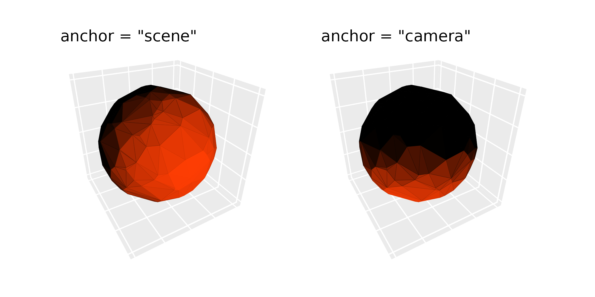

### Positional lighting

In addition to directional lighting (parallel rays from a direction),
ggcube also supports positional lighting from a point source. Use
`position` instead of `direction` to specify a light source location in
data coordinates. Setting `distance_falloff = TRUE` applies
inverse-square intensity falloff from the light source position.

``` r

ggplot(mountain, aes(x, y, z)) +
  stat_surface_3d(fill = "red", color = "red") +
  coord_3d(
    light = light(position = c(.5, .7, 95), distance_falloff = TRUE,
                  mode = "hsl", contrast = .9),
    ratio = c(1.5, 2, 1))
```

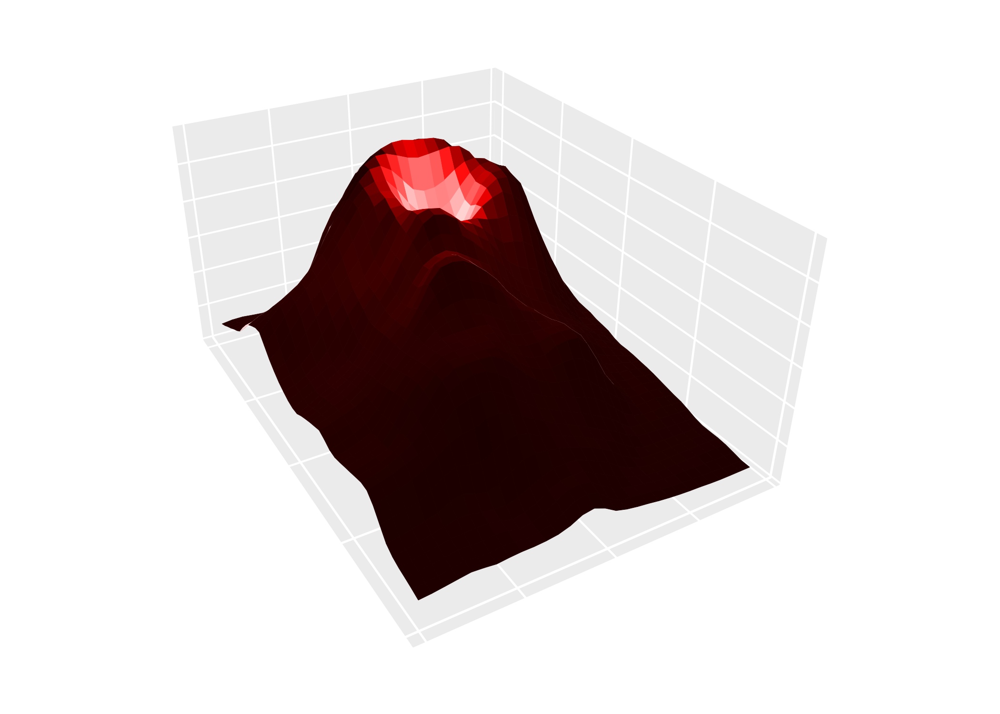

## Backface lighting

A backface is the side of a polygon facing the underside of a surface or
the inside of a volume. By default, backfaces receive inverted lighting
relative to frontfaces (`backface_scale = -1`), creating strong visual
contrast between the two sides. Setting `backface_scale = 1` lights
backfaces the same as frontfaces. Modifying `backface_offset` to
uniformly darkens or brightens all backfaces.

``` r

pb <- ggplot() +
  geom_function_3d(fun = function(x, y) x^2 + y^2,
                   xlim = c(-3, 3), ylim = c(-3, 3),
                   fill = "steelblue", color = "steelblue")

(pb + coord_3d(pitch = 0, roll = -70, yaw = 0,
               light = light(mode = "hsl")) +
    ggtitle("default:\nbackface_scale = -1\nbackface_offset = 0")) +
  (pb + coord_3d(pitch = 0, roll = -70, yaw = 0,
                 light = light(backface_scale = 1, mode = "hsl")) +
      ggtitle("\nbackface_scale = 1\nbackface_offset = 0")) +
  (pb + coord_3d(pitch = 0, roll = -70, yaw = 0,
              light = light(backface_scale = 1, mode = "hsl",
                            backface_offset = -.5)) +
      ggtitle("\nbackface_scale = 1\nbackface_offset = -0.5")) +
  plot_layout(nrow = 1)
```

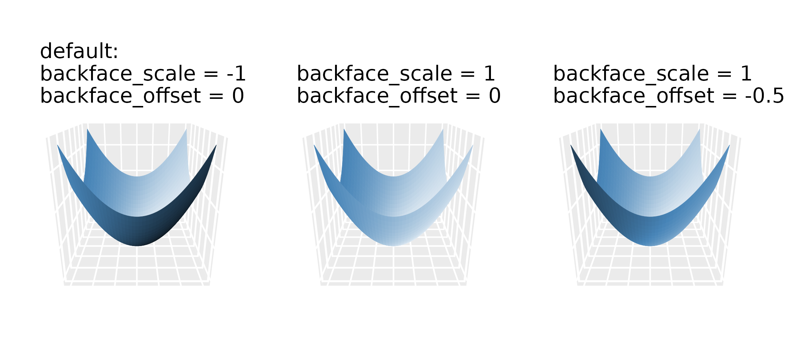

## 3D guides

When lighting is active, standard color guides don’t reflect the range
of shaded colors visible in the plot. ggcube provides
[`guide_colorbar_3d()`](https://matthewkling.github.io/ggcube/reference/guide_3d.md)
and
[`guide_legend_3d()`](https://matthewkling.github.io/ggcube/reference/guide_3d.md)
to create guides that show the full shading gradient:

``` r

ggplot(mountain, aes(x, y, z, fill = z)) +
  stat_surface_3d(light = light(mode = "hsl", direction = c(1, 0, 0))) +
  guides(fill = guide_colorbar_3d()) +
  scale_fill_gradientn(colors = c("tomato", "dodgerblue")) +
  coord_3d(ratio = c(2, 3, 1.5))
```

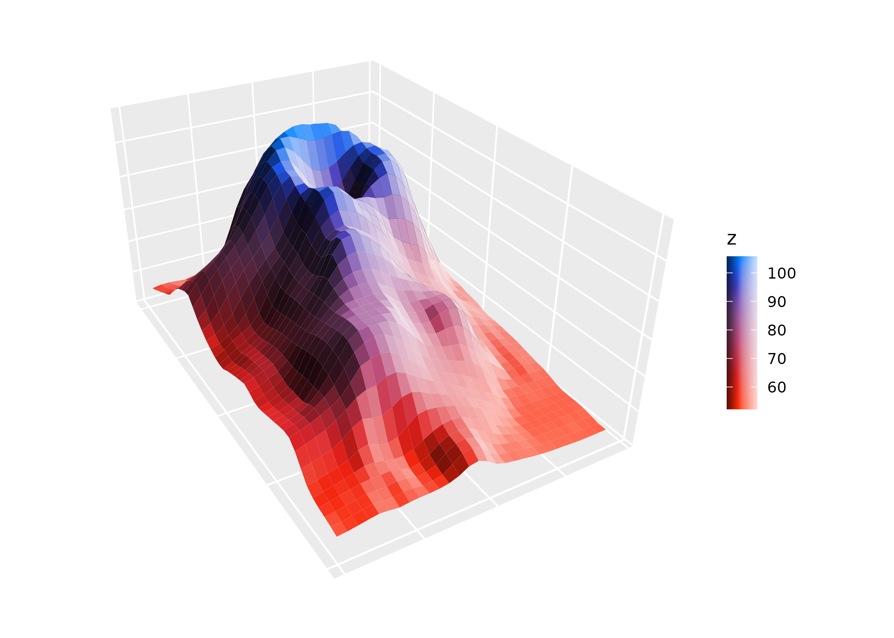

``` r

ggplot(mountain, aes(x, y, z, fill = x > .5, group = 1)) +
  stat_surface_3d(light = light(mode = "hsl", direction = c(1, 0, 0))) +
  guides(fill = guide_legend_3d()) +
  coord_3d(ratio = c(2, 3, 1.5))
```

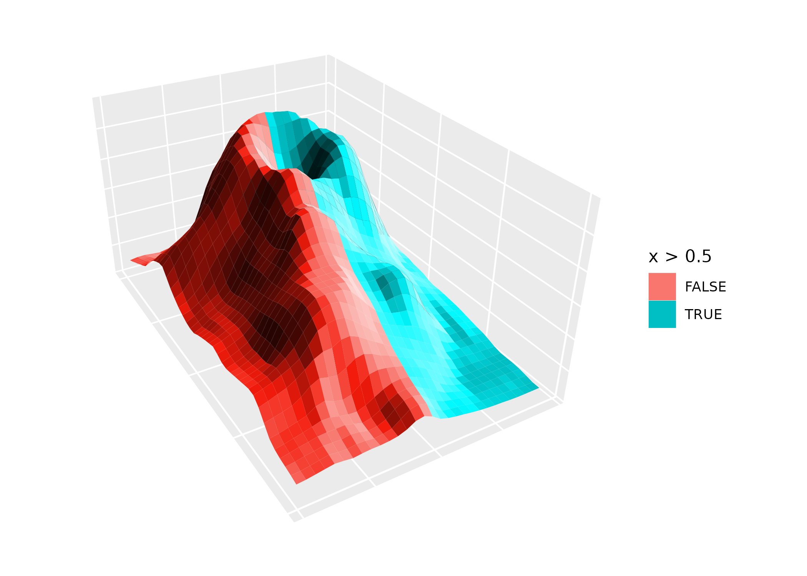

Both guides accept `shade_range` to control the range of shading shown
(a length-2 vector in the range -1 to 1), and `reverse_shade` to flip
the gradient direction.

Note that when fill and color map to the same variable, ggplot2 creates
a shared scale. In this case, apply the 3D guide via
`guides(fill = guide_colorbar_3d())`, not via the color guide.
