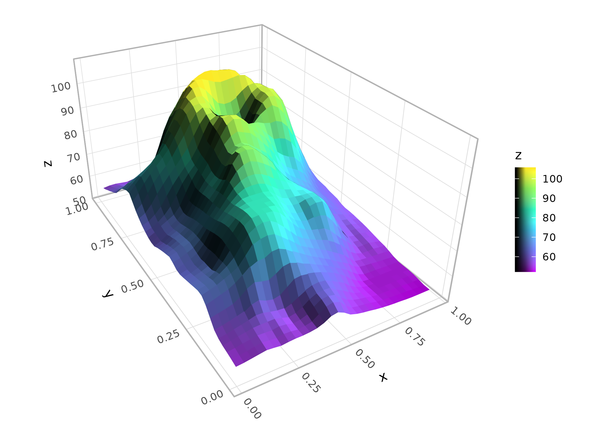
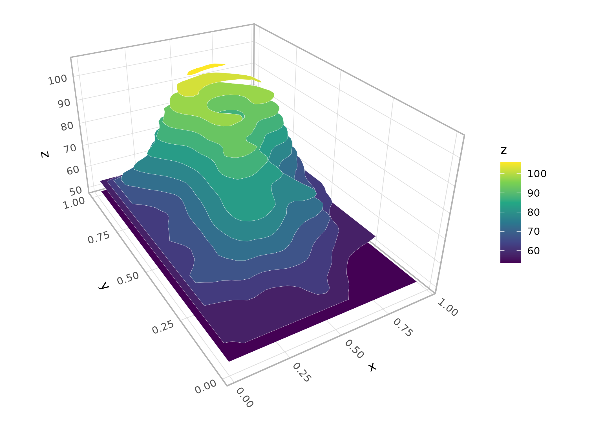
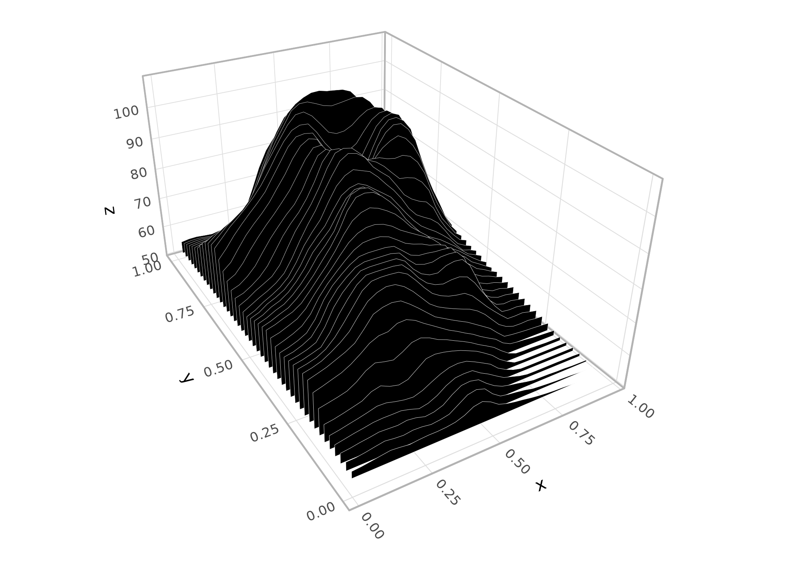
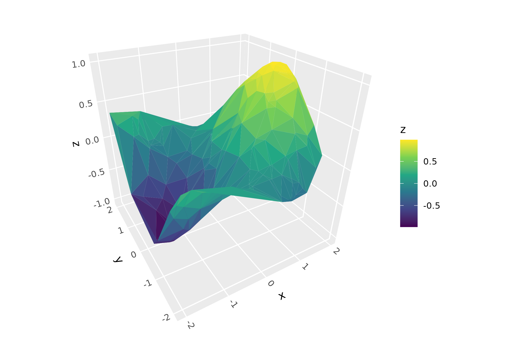
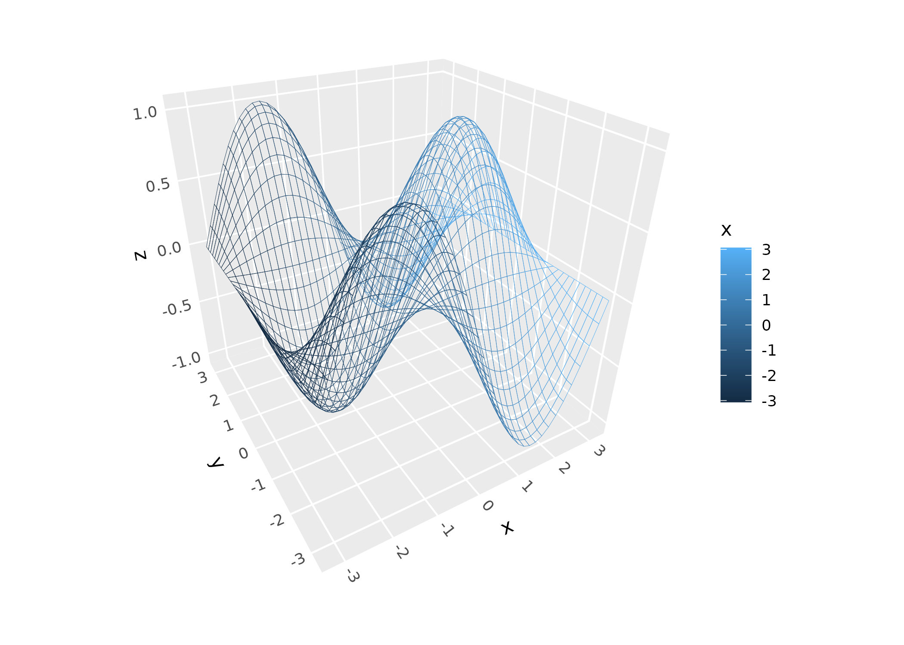
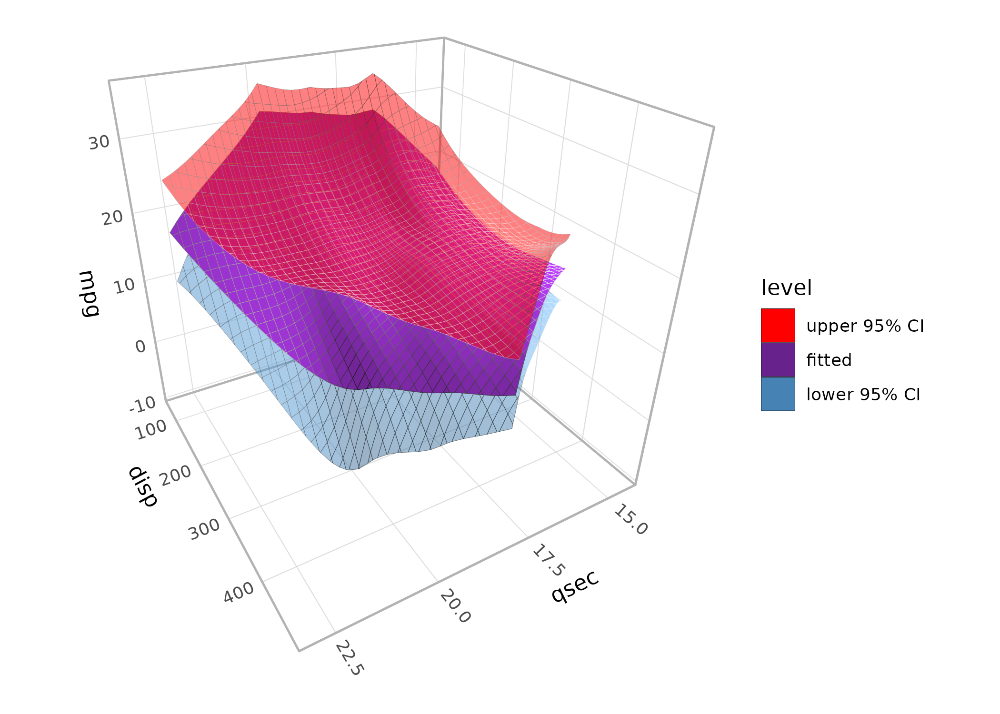
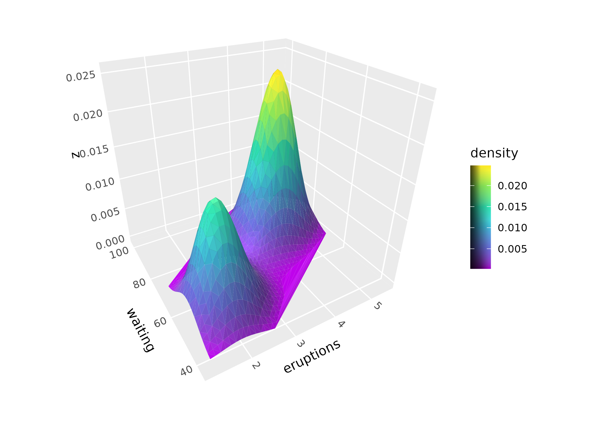
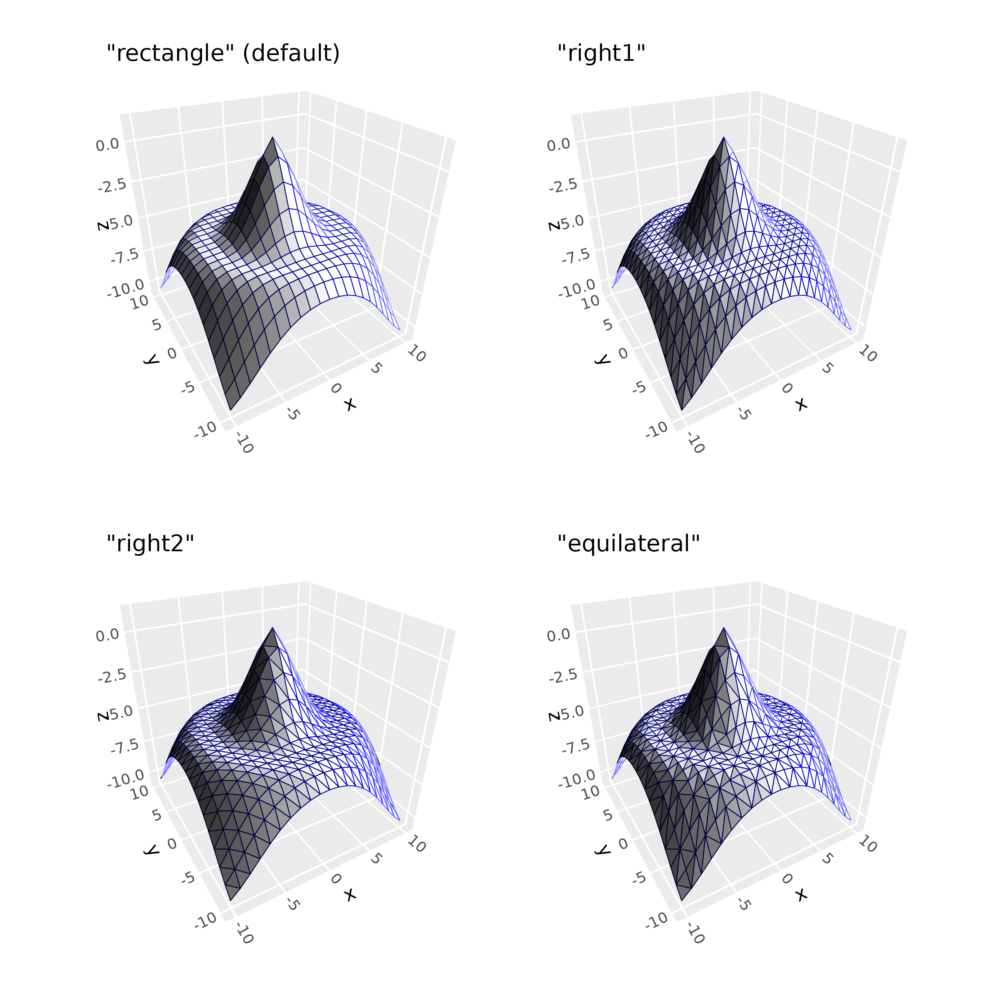
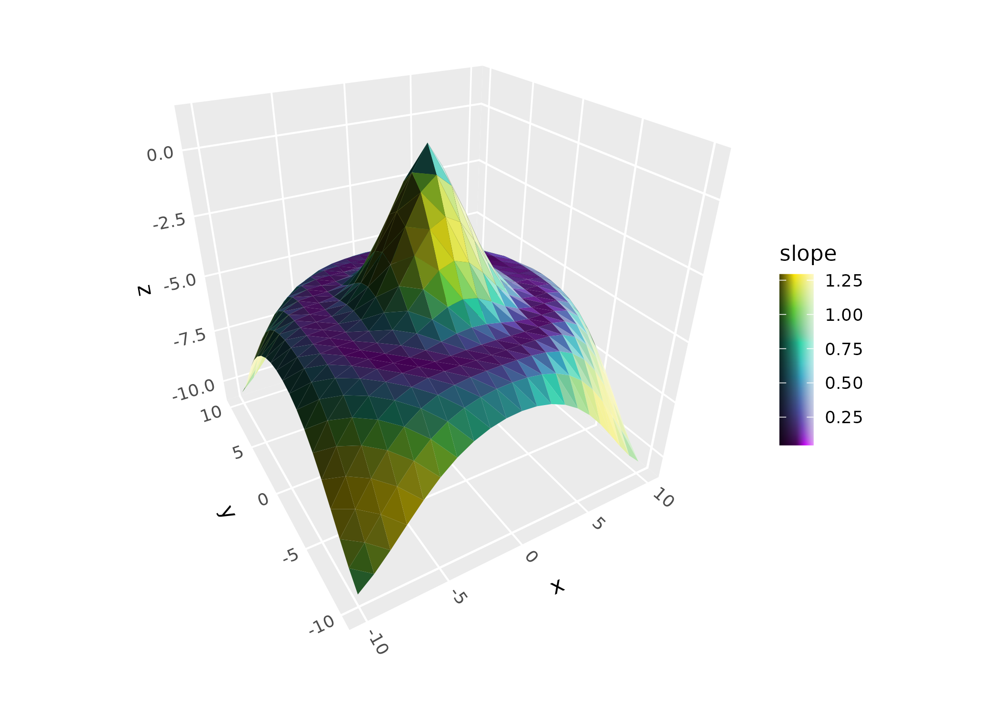
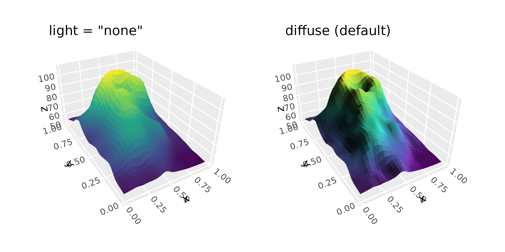

# Surfaces

``` r

library(ggcube)
library(patchwork)
```

Surfaces are ggcube’s richest feature area. This article gives an
overview of the geoms and stats that work together to render continuous
surfaces from various data sources. “Surface” here means a data object
with a single z value for each (x, y) position, like a heightmap or
terrain model. This vignette doesn’t cover hulls
([`geom_hull_3d()`](https://matthewkling.github.io/ggcube/reference/geom_hull_3d.md))
or columnar surfaces
([`geom_col_3d()`](https://matthewkling.github.io/ggcube/reference/geom_col_3d.md)).

Surfaces can be rendered from several data sources and in several visual
styles, using a system of interchangeable geoms and stats. ggcube
currently includes three surface geoms:

- [`geom_surface_3d()`](https://matthewkling.github.io/ggcube/reference/stat_surface_3d.md):
  tessellated mesh, rendered as a solid surface or a wireframe
- [`geom_contour_3d()`](https://matthewkling.github.io/ggcube/reference/geom_contour_3d.md):
  stacks of elevation contour polygons
- [`geom_ridgeline_3d()`](https://matthewkling.github.io/ggcube/reference/geom_ridgeline_3d.md):
  arrays of horizontal cross-section polygons

Each of these geoms can render data produced by one of four surface
stats:

- [`stat_surface_3d()`](https://matthewkling.github.io/ggcube/reference/stat_surface_3d.md):
  user-supplied irregular or gridded data
- [`stat_function_3d()`](https://matthewkling.github.io/ggcube/reference/stat_function_3d.md):
  mathematical functions
- [`stat_smooth_3d()`](https://matthewkling.github.io/ggcube/reference/geom_smooth_3d.md):
  statistical models fit to user-supplied data
- [`stat_density_3d()`](https://matthewkling.github.io/ggcube/reference/stat_density_3d.md):
  2D kernel density surface

## Data sources

Surface data comes in two forms:

- **Regular grids** have a z value at every combination of x and y
  positions — like a raster or DEM. Grid data can be supplied directly
  by the user, or generated internally by a stat.
- **Irregular points** are scattered (x, y, z) observations with no grid
  structure. These are triangulated via Delaunay tessellation to produce
  a surface mesh.

[`stat_surface_3d()`](https://matthewkling.github.io/ggcube/reference/stat_surface_3d.md)
auto-detects which type of data it receives and handles both. All three
surface geoms work with regular grid data, but only
[`geom_surface_3d()`](https://matthewkling.github.io/ggcube/reference/stat_surface_3d.md)
supports irregular points (since ridgelines and contours require an
underlying grid structure).

## Surface geoms

Three geoms render surface data in different visual styles.

### Tessellated mesh

[`geom_surface_3d()`](https://matthewkling.github.io/ggcube/reference/stat_surface_3d.md)
is the primary surface geom. You can use it to create a solid surface as
shown here, or set `fill = NA` to produce a wireframe. It tessellates
data into polygon tiles and supports both regular grids and irregular
point data:

``` r

p <- ggplot(mountain, aes(x, y, z, fill = z, color = z)) +
  coord_3d(ratio = c(1, 1.5, .75)) +
  scale_fill_viridis_c() +
  scale_color_viridis_c() +
  theme_light()

p + geom_surface_3d(light = light(direction = c(1, 0, .5),
                                mode = "hsv", contrast = 1.5),
                  linewidth = .2) +
  guides(fill = guide_colorbar_3d())
```



### Contours

[`geom_contour_3d()`](https://matthewkling.github.io/ggcube/reference/geom_contour_3d.md)
creates filled contour bands stacked at their respective elevations,
like a topographic layer-cake. The `bins` or `breaks` parameters control
the contour levels:

``` r

p + geom_contour_3d(bins = 12, color = "white", light = "none")
```



### Ridgelines

[`geom_ridgeline_3d()`](https://matthewkling.github.io/ggcube/reference/geom_ridgeline_3d.md)
slices a surface into cross-sections, producing a ridgeline view. The
`direction` parameter controls the slicing axis:

``` r

p + stat_surface_3d(geom = "ridgeline_3d", direction = "y",
                    fill = "black", color = "white",
                    light = "none", linewidth = .1)
```



### Mixing stats and geoms

Each of these geoms can be paired with any of the surface stats
described below. For example, `stat_function_3d(geom = "contour_3d")`
renders a mathematical function as contour bands, and
`stat_function_3d(geom = "ridgeline_3d")` renders it as ridgelines.

## Surface stats

Four stats produce surface data. Each generates a regular grid of (x, y,
z) points that can be rendered by any of the three surface geoms.

### User-supplied data

[`stat_surface_3d()`](https://matthewkling.github.io/ggcube/reference/stat_surface_3d.md)
is the default stat for
[`geom_surface_3d()`](https://matthewkling.github.io/ggcube/reference/stat_surface_3d.md).
It works with regular grids, and with irregular point data for which it
performs Delaunay triangulation as shown here:

``` r

set.seed(42)
pts <- data.frame(x = runif(200, -2, 2), y = runif(200, -2, 2))
pts$z <- with(pts, sin(x) * cos(y))

ggplot(pts, aes(x, y, z = z, fill = z)) +
  stat_surface_3d(sort_method = "pairwise") +
  scale_fill_viridis_c() +
  coord_3d(light = "none")
```



### Mathematical functions

[`stat_function_3d()`](https://matthewkling.github.io/ggcube/reference/stat_function_3d.md)
evaluates a function f(x, y) over a grid:

``` r

ggplot(mapping = aes(color = after_stat(x))) +
  geom_function_3d(fun = function(x, y) sin(x) * cos(y),
                   xlim = c(-pi, pi), ylim = c(-pi, pi),
                   fill = NA) + # disable fill to make wireframe
  coord_3d(light = "none")
```



### Statistical models

[`stat_smooth_3d()`](https://matthewkling.github.io/ggcube/reference/geom_smooth_3d.md)
(or
[`geom_smooth_3d()`](https://matthewkling.github.io/ggcube/reference/geom_smooth_3d.md))
fits a model to scattered (x, y, z) data and renders the fitted surface.
It has options for different model types, for overlaying data point and
residual lines, and for adding confidence interval surfaces as shown
here:

``` r

ggplot(mtcars, aes(qsec, disp, mpg, fill = after_stat(level))) +
      geom_smooth_3d(domain = "chull", se = TRUE, color = "black") +
      scale_fill_manual(values = c("red", "darkorchid4", "steelblue")) +
      coord_3d(yaw = 150) + theme_light()
```



### Kernel density

[`stat_density_3d()`](https://matthewkling.github.io/ggcube/reference/stat_density_3d.md)
(or
[`geom_density_3d()`](https://matthewkling.github.io/ggcube/reference/stat_density_3d.md))
computes a 2D kernel density estimate. It has options for modifying
bandwidth, resolution:

``` r

ggplot(faithful, aes(eruptions, waiting)) +
  geom_density_3d(min_ndensity = .01) +
  guides(fill = guide_colorbar_3d()) +
  coord_3d() +
  scale_fill_viridis_c()
```



## Working with surface meshes

The following options apply to
[`geom_surface_3d()`](https://matthewkling.github.io/ggcube/reference/stat_surface_3d.md)
and the tessellated mesh it produces.

### Grid types

The `grid` parameter controls tile geometry. The default `"rectangle"`
produces rectangular tiles. `"right1"` and `"right2"` split each
rectangle into right triangles along opposite diagonals, and
`"equilateral"` produces an equilateral triangular lattice. Triangulated
grids can prevent lighting artifacts on sharply curving surfaces:

``` r

d <- dplyr::mutate(tidyr::expand_grid(x = -10:10, y = -10:10),
                   z = sqrt(x^2 + y^2) / 1.5,
                   z = cos(z) - z)
p <- ggplot(d, aes(x, y, z)) +
  coord_3d(light = light(mode = "hsl", direction = c(1, 0, 0)))

(p + geom_surface_3d(fill = "white", color = "darkblue",
                      linewidth = .2) +
    ggtitle('"rectangle" (default)')) +
  (p + geom_surface_3d(fill = "white", color = "darkblue",
                        linewidth = .2, grid = "right1") +
      ggtitle('"right1"')) +
  (p + geom_surface_3d(fill = "white", color = "darkblue",
                        linewidth = .2, grid = "right2") +
      ggtitle('"right2"')) +
  (p + geom_surface_3d(fill = "white", color = "darkblue",
                        linewidth = .2, grid = "equilateral") +
      ggtitle('"equilateral"')) +
  plot_layout(ncol = 2)
```



### Computed variables

Surface stats compute gradient information at each grid point, available
via
[`after_stat()`](https://ggplot2.tidyverse.org/reference/aes_eval.html):
partial derivatives (`dzdx`, `dzdy`), gradient magnitude (`slope`), and
direction of steepest ascent (`aspect`):

``` r

p + geom_surface_3d(aes(fill = after_stat(slope)), grid = "right2") +
  scale_fill_viridis_c() +
  guides(fill = guide_colorbar_3d())
```



### Lighting

Surfaces often benefit from ggcube’s lighting system, which modifies
polygon face colors based on their orientation relative to a light
source. Note that since contours and ridgelines have uniform polygon
orientation, they typically do not benefit from lighting. See
[`vignette("lighting")`](https://matthewkling.github.io/ggcube/articles/lighting.md)
for details.

``` r

p <- ggplot(mountain, aes(x, y, z)) +
  coord_3d(ratio = c(1, 1.5, .75)) +
  scale_fill_viridis_c() + scale_color_viridis_c() +
  theme(legend.position = "none")

(p + geom_surface_3d(aes(fill = z, color = z), light = "none") +
    ggtitle('light = "none"')) +
  (p + geom_surface_3d(aes(fill = z, color = z),
                        light = light(direction = c(1, 0, 0))) +
      ggtitle("diffuse (default)")) +
  plot_layout(ncol = 2)
```


