# ggcube

**ggcube** lets you build 3D figures using ggplot2. Use it to create 3D
surfaces, volumes, scatter plots, and complex layered visualizations
using familiar ggplot2 syntax with `aes(x, y, z)` and
[`coord_3d()`](https://matthewkling.github.io/ggcube/reference/coord_3d.md).

The package provides a variety of 3D-specific `geoms` to render
surfaces, prisms, points, paths, and text in 3D; it also works with some
standard ggplot2 layer functions. You can control plot geometry with 3D
projection parameters, apply a range of 3D lighting models, and mix 3D
layers with 2D layers rendered on cube faces. Standard ggplot2 features
like faceting, themes, scales, and legends work as expected.

3D plots are wonderful for exploration, storytelling, and data art. But
note that for precise quantitative communication, where occlusion and
perspective distortion can be problematic, 2D is usually the better
choice.

## Installation

``` r

# You can install the package from CRAN:
install.packages("ggcube")

# Or get the development version from GitHub:
devtools::install_github("matthewkling/ggcube")
```

## Related packages

R has several other tools for 3D visualization. ggcube is designed for
users who want to stay within the ggplot2 ecosystem. Other packages
offer different tradeoffs:

- [**plotly**](https://plotly.com/r/) and
  [**rgl**](https://dmurdoch.github.io/rgl/) provide interactive 3D
  viewers with rotation and zoom via WebGL/OpenGL, using their own APIs.
- [**rayshader**](https://www.rayshader.com/) produces ray-traced
  renderings of terrain data with photorealistic lighting and shadows;
  it also makes 3D popups of ggplot2 figures, but not 3D ggplots per se.
- [**gg3D**](https://github.com/AckerDWM/gg3D) was another ggplot2
  extension for 3D plotting, but is no longer actively maintained.

## Quick start

The essential ingredient of a ggcube plot is
[`coord_3d()`](https://matthewkling.github.io/ggcube/reference/coord_3d.md).
Adding this to a standard ggplot, and providing a `z` aesthetic
variable, creates a 3D plot:

``` r

library(ggplot2)
library(ggcube)

# Basic 3D scatter plot
ggplot(mpg, aes(x = displ, y = hwy, z = drv, color = class)) +
      geom_point() +
      coord_3d()
```

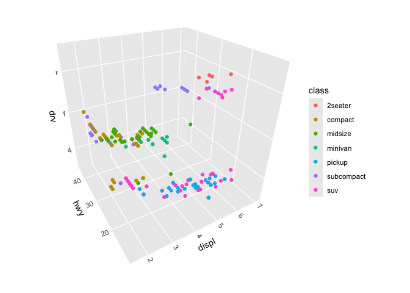

You can control plot rotation, perspective, and dimensions, as well as
axis label placement and panel selection, via parameters to
[`coord_3d()`](https://matthewkling.github.io/ggcube/reference/coord_3d.md).
See the [3D
view](https://matthewkling.github.io/ggcube/articles/coord_3d.html)
article for a comprehensive guide.

``` r

ggplot(mpg, aes(displ, hwy, drv, color = class)) +
      geom_point() +
      coord_3d(pitch = 0, roll = 60, yaw = 0, dist = 1.4, 
               ratio = c(2, 1, 1), panels = "all") +
      theme(panel.border = element_rect(color = "black"),
            panel.foreground = element_rect(alpha = .1))
```

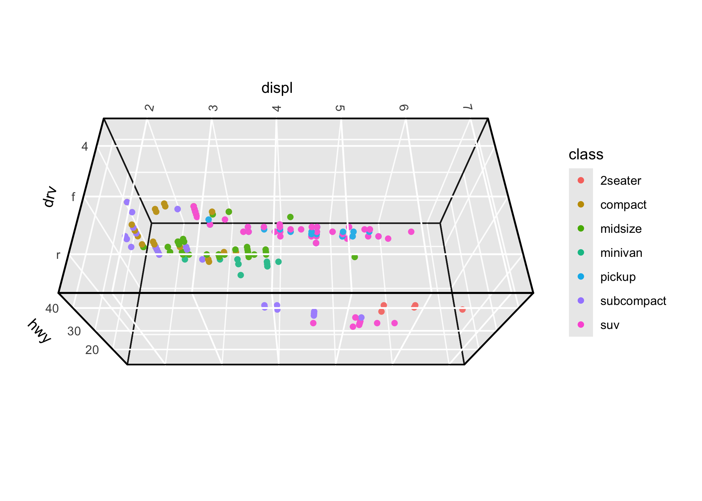

## 3D surfaces

- [`geom_surface_3d()`](https://matthewkling.github.io/ggcube/reference/stat_surface_3d.md)
  renders surfaces based on existing grid data such as terrain data
- [`geom_ridgeline_3d()`](https://matthewkling.github.io/ggcube/reference/geom_ridgeline_3d.md)
  renders surfaces as a series of cross-sections
- [`geom_contour_3d()`](https://matthewkling.github.io/ggcube/reference/geom_contour_3d.md)
  renders surfaces as layer cakes of stacked contours
- [`stat_function()`](https://ggplot2.tidyverse.org/reference/geom_function.html)
  visualizes mathematical functions
- [`stat_smooth_3d()`](https://matthewkling.github.io/ggcube/reference/geom_smooth_3d.md)
  fits statistical models with two predictors and visualizes fitted
  surfaces with confidence intervals
- [`stat_density_3d()`](https://matthewkling.github.io/ggcube/reference/stat_density_3d.md)
  creates perspective visualizations of 2D kernel density estimates
- [`stat_hull_3d()`](https://matthewkling.github.io/ggcube/reference/geom_hull_3d.md)
  plots triangulated volumes based on convex or alpha hulls of 3D points

See the
[surfaces](https://matthewkling.github.io/ggcube/articles/surfaces.html)
article for a full guide to surface options.

Example: a terrain surface using
[`geom_surface_3d()`](https://matthewkling.github.io/ggcube/reference/stat_surface_3d.md):

``` r

ggplot(mountain, aes(x, y, z)) +
      geom_surface_3d(aes(fill = z, color = z)) +
      scale_fill_viridis_c() + scale_color_viridis_c() +
      coord_3d(ratio = c(1.5, 2, 1), expand = FALSE, panels = "zmin",
               light = light(direction = c(1, 0, 0))) +
      guides(fill = guide_colorbar_3d()) +
      theme_light()
```

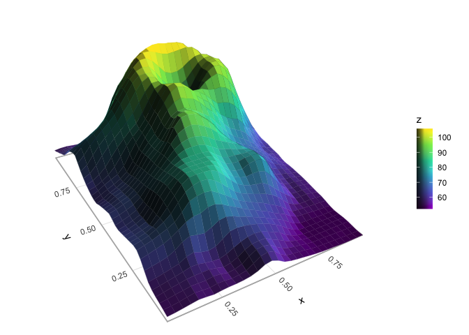

Example: a terrain surface using
[`geom_contour_3d()`](https://matthewkling.github.io/ggcube/reference/geom_contour_3d.md):

``` r

ggplot(mountain, aes(x, y, z)) +
      geom_contour_3d(fill = "black", color = "white", linewidth = .5) +
      coord_3d(yaw = 60, ratio = c(1.5, 2, 1), light = "none") +
      theme_void()
```

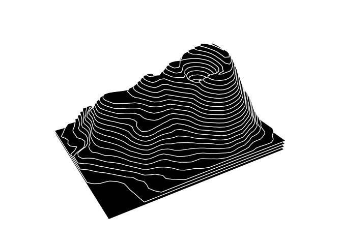

Example: a mathematical surface using
[`geom_function_3d()`](https://matthewkling.github.io/ggcube/reference/stat_function_3d.md):

``` r

ggplot() +
      geom_function_3d(fun = function(x1, x2) cos(x1) * sin(x2),
                       xlim = c(-pi, pi), ylim = c(-2*pi, 2*pi),
                       fill = "#7a2100", color = "#b3725b", 
                       grid = "right1", linewidth = .2) +
      coord_3d(yaw = 160, roll = -70, 
               scales = "fixed", ratio = c(1, 1, 2)) +
      labs(x = expression(x[1]),
           y = expression(x[2]),
           z = expression(cos(x[1]) %*% sin(x[2]))) +
      theme_minimal()
```

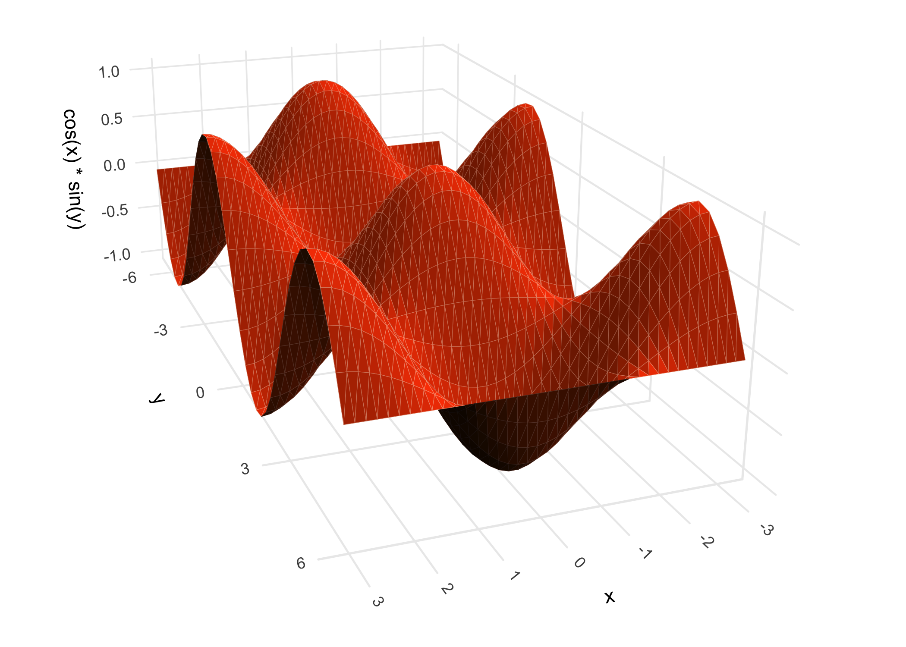

Example: a fitted model surface using
[`geom_smooth_3d()`](https://matthewkling.github.io/ggcube/reference/geom_smooth_3d.md):

``` r

# Generate scattered 3D data
set.seed(123)
d <- data.frame(x = rnorm(50),
                y = rnorm(50))
d$z <- d$x + d$x^2 - d$y^2 + rnorm(50)

# Plot GAM fit with uncertainty layers
ggplot(d, aes(x, y, z)) + 
      geom_smooth_3d(aes(fill = after_stat(level)),
                     method = "gam", formula = z ~ te(x, y),
                     se = TRUE, level = 0.99,
                     color = "black", grid = "equilateral") +
      scale_fill_manual(values = c("red", "darkorchid4", "steelblue")) +
      coord_3d(light = NULL)
```

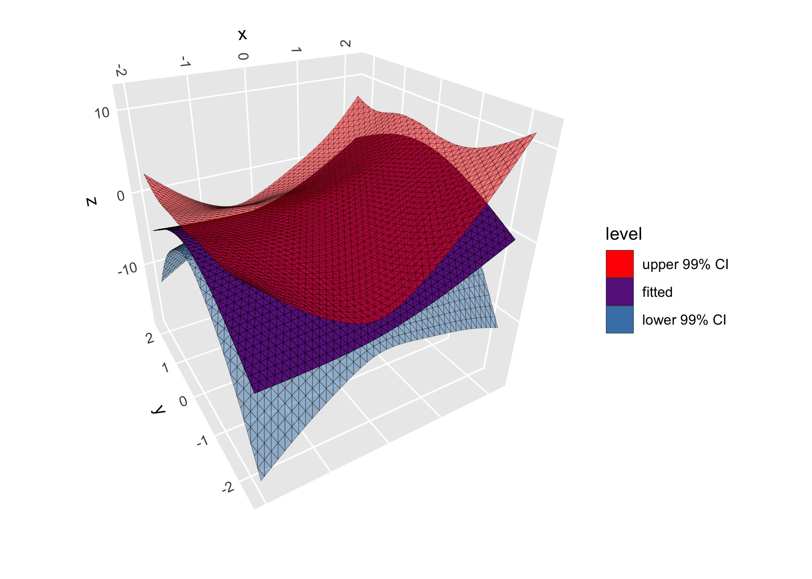

## 3D paths

[`geom_path_3d()`](https://matthewkling.github.io/ggcube/reference/geom_path_3d.md)
renders paths in 3D space with depth-based sorting and scaling:

``` r

butterfly <- ggcube:::lorenz_attractor(n_points = 8000, dt = .01)
ggplot(butterfly, aes(x, y, z, color = time)) +
      geom_path_3d(linewidth = 0.1, color = "black",
                   position = position_on_face(c("xmax", "ymax", "zmin"))) +
      geom_path_3d(linewidth = 0.3) +
      scale_color_gradientn(colors = c("blue", "purple", "red", "orange")) +
      coord_3d() +
      theme_light()
```

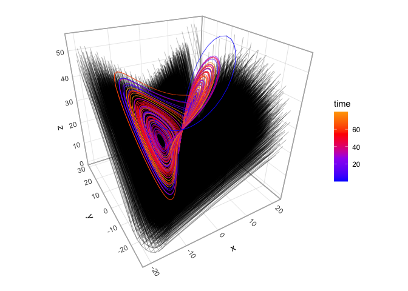

## 3D points

While
[`ggplot2::geom_point()`](https://ggplot2.tidyverse.org/reference/geom_point.html)
works with ggcube as demonstrated above,
[`geom_point_3d()`](https://matthewkling.github.io/ggcube/reference/geom_point_3d.md)
creates 3D-aware scatter plots with proper point ordering, depth-scaled
point sizes, and options to include reference lines and reference points
projecting 3D points onto 2D face panels:

``` r

ggplot(mpg, aes(x = displ, y = hwy, z = drv, fill = class)) +
      geom_point_3d(size = 3, shape = 21, color = "black", stroke = .1,
                    ref_lines = TRUE, ref_points = TRUE,
                    ref_faces = c("ymax", "xmax")) +
      coord_3d()
```

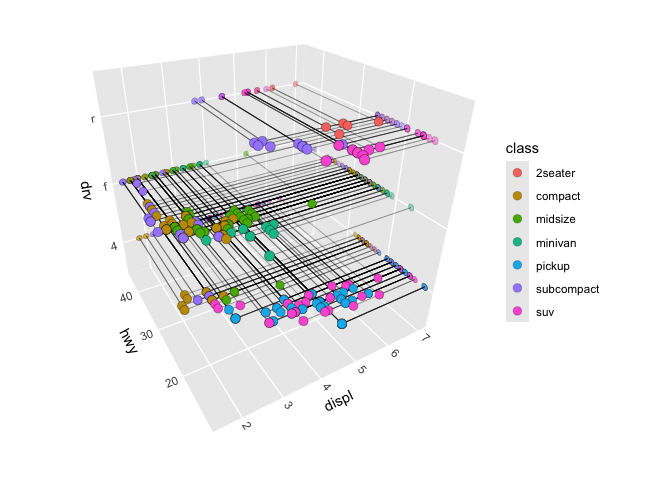

## 3D prisms

- [`geom_col_3d()`](https://matthewkling.github.io/ggcube/reference/geom_col_3d.md)
  produces 3D column charts
- [`geom_bar_3d()`](https://matthewkling.github.io/ggcube/reference/geom_bar_3d.md)
  creates 3D histograms of 2D discrete or continuous variables
- [`geom_voxel_3d()`](https://matthewkling.github.io/ggcube/reference/geom_voxel_3d.md)
  renders sparse 3D pixel data as arrays of cubes

Example: a 3D histogram using
[`geom_bar_3d()`](https://matthewkling.github.io/ggcube/reference/geom_bar_3d.md):

``` r

ggplot(faithful, aes(waiting, eruptions)) +
      geom_bar_3d(fill = "steelblue", color = "steelblue", 
                  bins = 15, width = .9) +
      coord_3d(yaw = 60) +
      scale_z_continuous(expand = c(0, 0))
```

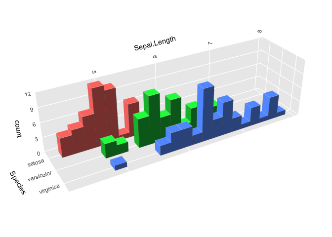

## 3D text

[`geom_text_3d()`](https://matthewkling.github.io/ggcube/reference/geom_text_3d.md)
creates 3D-aware text, rendered either as “billboard” text that faces
the viewing plane or as 3D polygons that can face any direction:

``` r

df <- expand.grid(x = c("B", "H", "N"), y = c("a", "o", "u"), z = c("g", "t"))
df$label <- paste0(df$x, df$y, df$z)
ggplot(df, aes(x, y, z, label = label, fill = x)) +
      geom_text_3d(method = "polygon", facing = "zmax", 
                   size = 5, weight = "bold") +
      coord_3d(scales = "fixed", rotate_labels = FALSE) +
      theme(axis.title = element_blank())
```

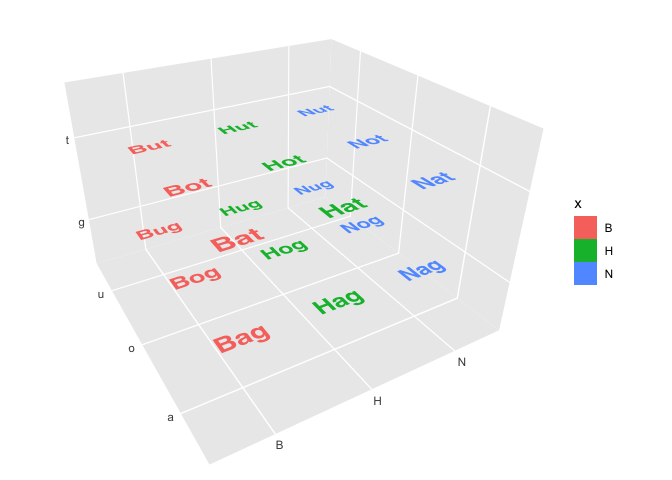

## Lighting effects

Lighting of 3D polygon layers is controlled by providing a
[`light()`](https://matthewkling.github.io/ggcube/reference/light.md)
specification to the layer function or to
[`coord_3d()`](https://matthewkling.github.io/ggcube/reference/coord_3d.md).
See the [lighting and
shading](https://matthewkling.github.io/ggcube/articles/lighting.html)
article for a comprehensive guide.

``` r

ggplot(sphere_points, aes(x, y, z)) +
      coord_3d(scales = "fixed") +
      scale_fill_viridis_c() +
      scale_color_viridis_c() +
      theme_dark() +
      theme(legend.position = "none") +
      
      # apply shading to solid color/fill
      geom_hull_3d(fill = "#8a2900", color = "#8a2900",
                   light = light(method = "direct", mode = "hsl", 
                                 direction = c(0, 0, 1))) +
      
      # apply shading to aesthetic color/fill
      geom_hull_3d(aes(x = x + 2.5, fill = x, color = x),
                   light = light(method = "diffuse", mode = "hsv", 
                                 direction = c(0, 0, 1), contrast = 2)) +
      
      # map surface orientation to 3D RGB color channels
      geom_hull_3d(aes(x = x + 5),
                   light = light(method = "rgb", direction = c(1, 0, -1)))
```

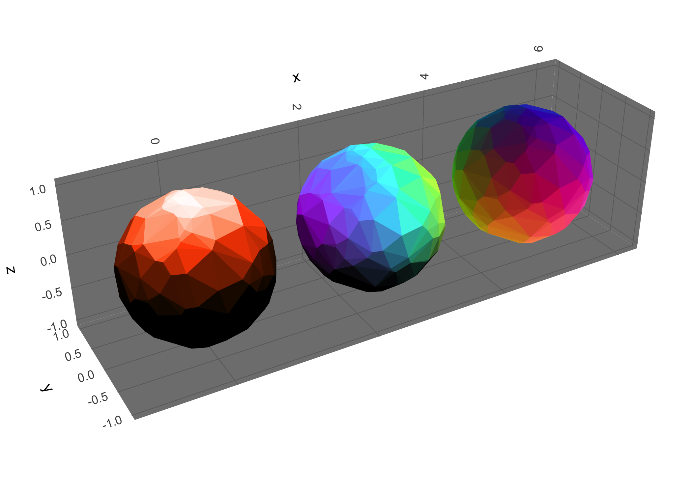

## Animation and interaction

A major limitation of 3D figures is that you can’t get a full view of
the data from any single angle. One way to mitigate this is by rotating
the figure to view the data from different directions. ggcube offers
animated rotation via
[`animate_3d()`](https://matthewkling.github.io/ggcube/reference/animate_3d.md),
and interactive drag-to-rotate plots via
[`orbit_3d()`](https://matthewkling.github.io/ggcube/reference/orbit_3d.md).
See the [animation and
interaction](https://matthewkling.github.io/ggcube/articles/animation.html)
article for details. Here’s an example of a rotating gif:

``` r

mammoth <- data.frame(do.call(rbind, rjson::fromJSON(
  file = paste0("https://raw.githubusercontent.com/PAIR-code/",
                "understanding-umap/master/raw_data/mammoth_3d_50k.json")
)))
colnames(mammoth) <- c("Y", "X", "Z")

p <- ggplot(mammoth, aes(X, Y, Z)) +
      geom_hull_3d(method = "alpha", radius = 8, 
                   fill = "darkred", color = "darkred",
                   light = light(mode = "hsl", direction = c(-1, 1, 0), anchor = "camera")) +
      coord_3d(roll = -90, scales = "fixed", 
               panels = "zmin", expand = FALSE) +
      theme(axis.text = element_blank(),
            axis.title = element_blank())

animate_3d(p, yaw = c(0, 360), nframes = 72, fps = 8, width = 700, cores = 8)
```

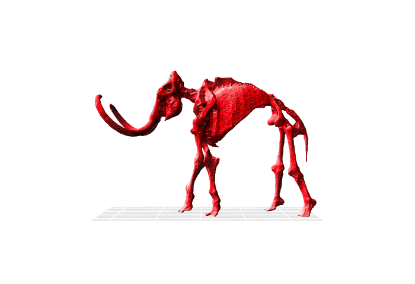

## Face projection

3D and 2D layers can be mixed by using
[`position_on_face()`](https://matthewkling.github.io/ggcube/reference/position_on_face.md)
to project data onto 2D cube faces. We saw this in the
[`geom_path_3d()`](https://matthewkling.github.io/ggcube/reference/geom_path_3d.md)
example above, but here’s another example that mixes different geoms,
including natively-2D layers like
[`ggplot2::stat_density_2d()`](https://ggplot2.tidyverse.org/reference/geom_density_2d.html):

``` r


ggplot(iris, aes(Sepal.Length, Sepal.Width, Petal.Length, 
                 color = Species, fill = Species)) +
      coord_3d() + xlim(4, 8) +
      
      # place 2D density plot on zmin face
      stat_density_2d(position = position_on_face(faces = "zmin", axes = c("x", "y")),
                      geom = "polygon", alpha = .1, linewidth = .25) +
      
      # flatten 3D hull layer onto ymax face
      geom_hull_3d(position = position_on_face("ymax"), alpha = .5) +
      
      # flatten 3D voxels onto xmax face to create 2D bins
      geom_voxel_3d(aes(round(Sepal.Length), round(Sepal.Width), round(Petal.Length)),
                    position = position_on_face("xmax"), alpha = .15, light = NULL) +
      
      # 3D scatter plot (added last so it renders in front)
      geom_point_3d( shape = 21, color = "black", stroke = .25)
```

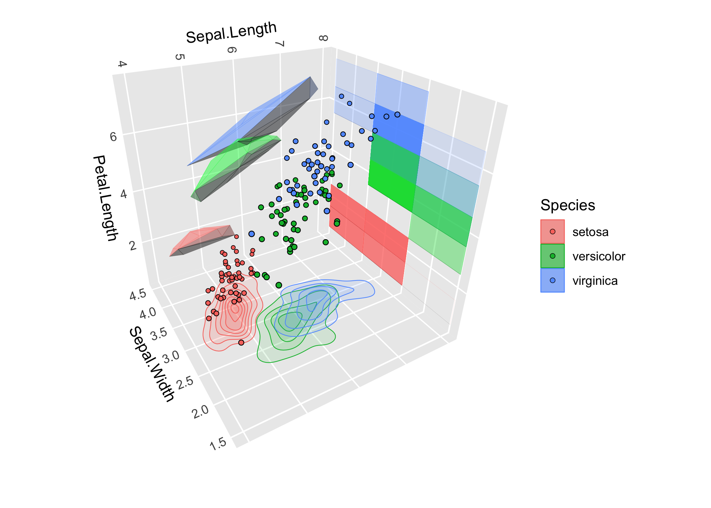

## Learn more

- The [getting
  started](https://matthewkling.github.io/ggcube/articles/ggcube.html)
  vignette gives a tour of the main features.
- The [3D
  view](https://matthewkling.github.io/ggcube/articles/coord_3d.html),
  [surfaces](https://matthewkling.github.io/ggcube/articles/surfaces.html),
  and [lighting and
  shading](https://matthewkling.github.io/ggcube/articles/lighting.html)
  articles go deeper on those topics.
- The [function
  reference](https://matthewkling.github.io/ggcube/reference/index.html)
  documents every exported function.
